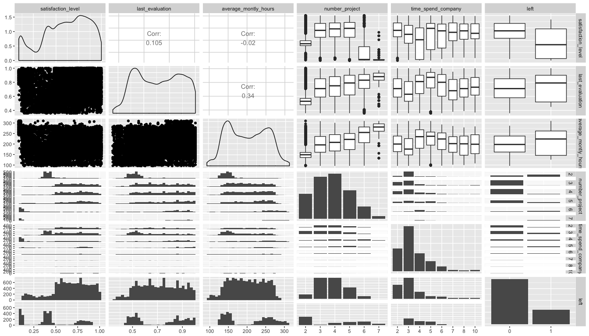
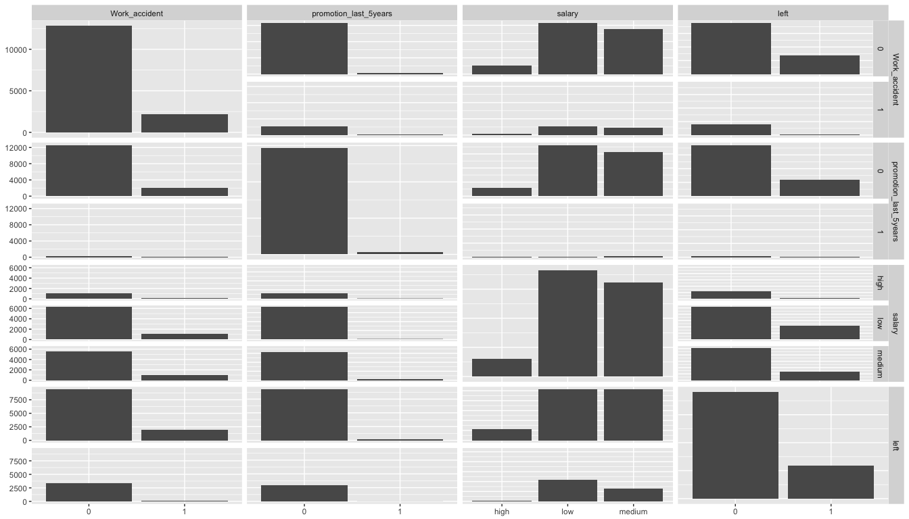
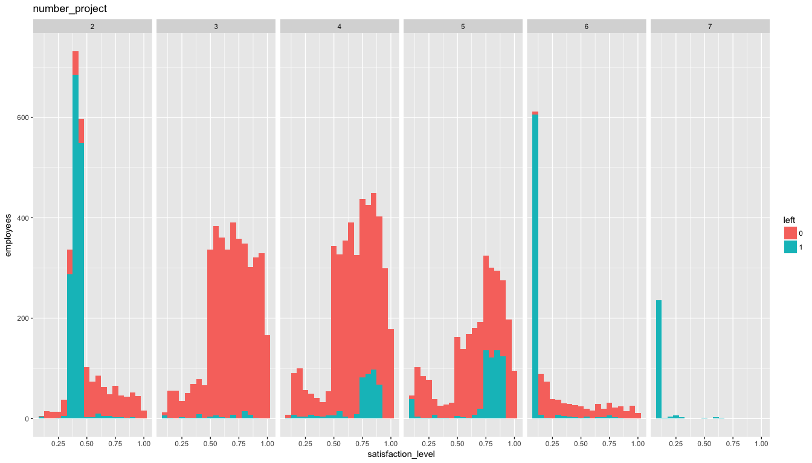
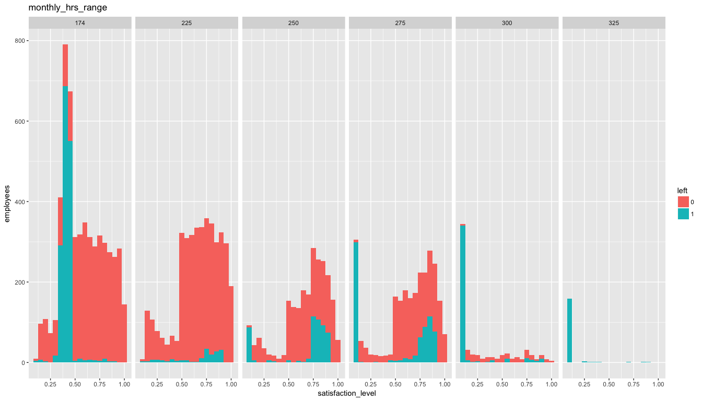
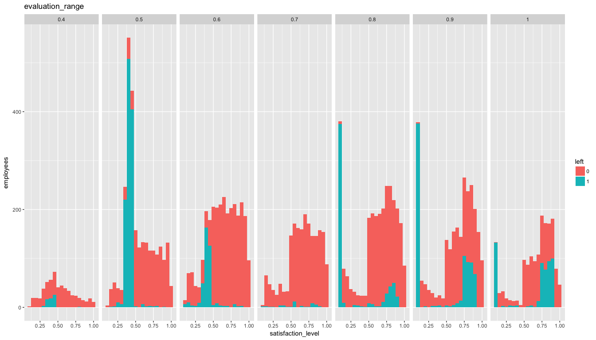
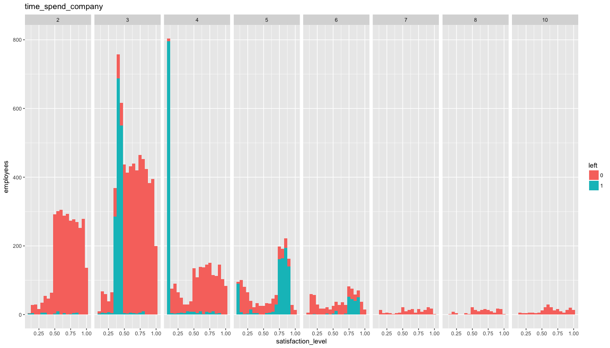

# HR Efficiency Analysis
`r format(Sys.Date())`  


##About Client and problem
The client is the HR department for company ABC.

HR Department wants to know:

* The factors that are important to the employees.
* Why are best and most experienced employees of ABC leaving prematurely.
* Provide recommendation to HR department to lower attrition rate and save on hiring costs.
* Build a predictive model to determine their probability in leaving.

## Data Source
https://www.kaggle.com/ludobenistant/hr-analytics

https://www.kaggle.com/ludobenistant/hr-analytics/downloads/human-resources-analytics.zip

#####Lets load the dataset and analyze

```r
hr <- read.csv("../HR_comma_sep.csv", 
               header = TRUE, 
               stringsAsFactors = FALSE)

summary(hr)
```

```
##  satisfaction_level last_evaluation  number_project  average_montly_hours
##  Min.   :0.0900     Min.   :0.3600   Min.   :2.000   Min.   : 96.0       
##  1st Qu.:0.4400     1st Qu.:0.5600   1st Qu.:3.000   1st Qu.:156.0       
##  Median :0.6400     Median :0.7200   Median :4.000   Median :200.0       
##  Mean   :0.6128     Mean   :0.7161   Mean   :3.803   Mean   :201.1       
##  3rd Qu.:0.8200     3rd Qu.:0.8700   3rd Qu.:5.000   3rd Qu.:245.0       
##  Max.   :1.0000     Max.   :1.0000   Max.   :7.000   Max.   :310.0       
##  time_spend_company Work_accident         left       
##  Min.   : 2.000     Min.   :0.0000   Min.   :0.0000  
##  1st Qu.: 3.000     1st Qu.:0.0000   1st Qu.:0.0000  
##  Median : 3.000     Median :0.0000   Median :0.0000  
##  Mean   : 3.498     Mean   :0.1446   Mean   :0.2381  
##  3rd Qu.: 4.000     3rd Qu.:0.0000   3rd Qu.:0.0000  
##  Max.   :10.000     Max.   :1.0000   Max.   :1.0000  
##  promotion_last_5years    sales              salary         
##  Min.   :0.00000       Length:14999       Length:14999      
##  1st Qu.:0.00000       Class :character   Class :character  
##  Median :0.00000       Mode  :character   Mode  :character  
##  Mean   :0.02127                                            
##  3rd Qu.:0.00000                                            
##  Max.   :1.00000
```

* _satisfaction_level_ - Employee Level of satisfaction. It ranges from __0 (low satisfaction)__ to __1 (high satisfaction)__
* _last_evaluation_ - Latest performance evaluation rating of employee. It ranges from __0 (low rating)__ to __1 (high rating)__
* _number_project_ - Number of projects completed while at work. It varies from __2__ to __7__ projects, on an average an employee has worked on __4__ projects.
* _average_montly_hours_ - Average monthly work hours at workplace. It varies from __96 hrs__ to __310 hrs__ with a mean of __201 hrs__ per month.
* _time_spend_company_ - Number of years spent in the company. It ranges from __2__ years to __10__ years, with an average of around __4__ years until now or until they left.
* _Work_accident_ - Whether the employee had a workplace accident
* _left_ - Whether the employee left the workplace or not. __1__ means __left__ and __0__ means still with company. Probability of leaving is __0.23__.
* _promotion_last_5years_ - Whether the employee was promoted in the last five years. __1__ means promoted and __0__ means no promotion in last 5 years. Probability of promotion in last 5 years is __0.02__.


* _sales_ - Department in which they work for. _accounting_, _hr_, _IT_, _management_,  _marketing_, _product_mng_, _RandD_, _sales_, _support_, _technical_ are various departments employees belong to.

```r
summary(as.factor(hr$sales))
```

```
##  accounting          hr          IT  management   marketing product_mng 
##         767         739        1227         630         858         902 
##       RandD       sales     support   technical 
##         787        4140        2229        2720
```

* _salary_ - Salary as high, medium & low.

```r
summary(as.factor(hr$salary))
```

```
##   high    low medium 
##   1237   7316   6446
```

* Fields _number_project_, _promotion_last_5years_, _left_, _Work_accident_, _sales_,_salary_ have discrete values.
* Looking at the summary of the data set there are no bad data , 'blanks', 'NA', null etc.

## Data Wrangling

Rename the _sales_ column to _dept_ and make columns _number_project_, _promotion_last_5years_, _left_, _Work_accident_, _sales_,_salary_ as factor

```r
#hr$number_project <- as.factor(hr$number_project)
hr$promotion_last_5years <- as.factor(hr$promotion_last_5years)
hr$left <- as.factor(hr$left)
hr$Work_accident <- as.factor(hr$Work_accident)
hr$sales <- as.factor(hr$sales)
hr$salary <- as.factor(hr$salary)

names(hr)[9] <- "dept"
```

Lets look at the structure

```r
  str(hr)
```

```
## 'data.frame':	14999 obs. of  10 variables:
##  $ satisfaction_level   : num  0.38 0.8 0.11 0.72 0.37 0.41 0.1 0.92 0.89 0.42 ...
##  $ last_evaluation      : num  0.53 0.86 0.88 0.87 0.52 0.5 0.77 0.85 1 0.53 ...
##  $ number_project       : int  2 5 7 5 2 2 6 5 5 2 ...
##  $ average_montly_hours : int  157 262 272 223 159 153 247 259 224 142 ...
##  $ time_spend_company   : int  3 6 4 5 3 3 4 5 5 3 ...
##  $ Work_accident        : Factor w/ 2 levels "0","1": 1 1 1 1 1 1 1 1 1 1 ...
##  $ left                 : Factor w/ 2 levels "0","1": 2 2 2 2 2 2 2 2 2 2 ...
##  $ promotion_last_5years: Factor w/ 2 levels "0","1": 1 1 1 1 1 1 1 1 1 1 ...
##  $ dept                 : Factor w/ 10 levels "accounting","hr",..: 8 8 8 8 8 8 8 8 8 8 ...
##  $ salary               : Factor w/ 3 levels "high","low","medium": 2 3 3 2 2 2 2 2 2 2 ...
```

## Data Exploration

###Quick exploratory analysis with ggpairs

Lets look at correlation between various attributes of the dataset


```r
hr_correl <- hr
hr_correl$number_project <- as.factor(hr_correl$number_project)
hr_correl$time_spend_company <- as.factor(hr_correl$time_spend_company)
hr_correl %>%  dplyr::select(
  satisfaction_level,
  last_evaluation,
  average_montly_hours,
  number_project,
  time_spend_company,
  left
  ) %>% ggpairs() 
```

<!-- -->

* We can see attributes _number_project_, _average_monthly_hours_, _last_evaluation_, _time_spend_company_ having correlation to _left_ and _satisfaction_level_.
* Looks like employees involved in 3 -5 projects and putting in 175 - 225 average monthly hours have lower rate of leaving company and have high satisfaction level.
* Assuming 22 working days a month, 175 - 225 average monthly hours translates to 8 - 10 hrs per day. 


```r
hr %>%  dplyr::select(Work_accident, promotion_last_5years, salary, left) %>% ggpairs()
```

<!-- -->


* Work_accident, promotion_last_5years & salary seems to have lower impact on employees leaving company.


###Exploratory Analysis using ggplots , geom_histogram & facet_grids
Lets plot satisfaction_level against facets number_project, average_montly_hours, time_spend_company, promotion_last_5years, Work_accident, salary & dept. Each plot correlates satisfaction_level(histogram), left (fill ) with one of the other attribute as facets. 

#### number_project

```r
hr_explore <- hr

hr_explore %>% ggplot(aes(satisfaction_level)) + 
  geom_histogram(binwidth = 0.05, aes(fill = left)) + labs(x = "satisfaction_level", y = "employees", title = "number_project") + 
  facet_grid(. ~ number_project) + 
  myTheme
```

<!-- -->
  
  * Most of employees having 2 projects are showing a high rate of leaving most of them seem to be mid level satisfaction_level. 
  * Most of the employees having 3 - 5 projects are having high satisfaction level. We can also see employees leaving creeping between 3 - 5 projects and most of employees leaving are having high satisfaction level too.
  * 6 - 7 projects however we see satisfaction level being very low and a very high rate employees leaving.

####average_montly_hours

```r
hr_explore$monthly_hrs_range <- cut(hr_explore$average_montly_hours,
                                    breaks = c(0, 174, 225, 250, 275, 300, 325, 350),
                                    labels = c("174", "225", "250", "275", "300", "325", "350"),
                                    right = FALSE
                                    )
hr_explore %>% ggplot(aes(satisfaction_level)) + 
  geom_histogram(binwidth = 0.05, aes(fill = left)) + labs(x = "satisfaction_level", y = "employees", title = "monthly_hrs_range") + 
  facet_grid(. ~monthly_hrs_range) + 
  myTheme
```

<!-- -->
  
  * Since average_montly_hours is continuous data, in order for being able to use as a facet lets make it a discrete by creating ranges / monthly_hrs_range. Starting at 174 hours as that is __normal__ average monthly hours.
  * Employees putting in 174 and less average monthly hours show medium satisfaction and very high rate of leaving.
  * Employees putting in 174 - 225 average monthly hours seem to have higher satisfaction level. Though we can see a small peak in employees leaving in this category. (8-10 hrs a day)
  * Employees putting in  225 - 275 average monthly hours show mostly higher satisfaction level and we can see rate of leaving in high satisfaction level creeping. (10 - 13 hours a day)
  * Employees putting in 275 hours and more average monthly hours are having a very low satisfaction level and are mostly leaving.

#### last_evaluation

```r
hr_explore$evaluation_range <- as.factor(round(hr_explore$last_evaluation,1))

hr_explore %>% ggplot(aes(satisfaction_level)) + 
  geom_histogram(binwidth = 0.05, aes(fill = left)) + labs(x = "satisfaction_level", y = "employees", title = "evaluation_range") + 
  facet_grid(. ~ evaluation_range) + 
  myTheme
```

<!-- -->

* Since last_evaluation is continuous  data, first lets round the last evaluation to 1 place and then make it into a factor
* Employees having evaluation rating 0.4 - 0.6, show satisfaction levels improving with rating and employees leaving have mostly medium satisfaction level.
* Employees at 0.7 rating show higher satisfaction level and low rate of quitting.
* Employees having higher rating of 0.8 - 1 show folks leaving with low satisfaction level high and gradually reducing but then employees with satisfaction and leaving is slowly creeping up.

#### time_spend_company

```r
hr_explore %>% ggplot(aes(satisfaction_level)) + 
  geom_histogram(binwidth = 0.05, aes(fill = left)) + labs(x = "satisfaction_level", y = "employees", title = "time_spend_company") + 
  facet_grid(. ~ time_spend_company) + 
  myTheme
```

<!-- -->

* Employees who have spent 2 years show very low rate of leaving and seem to have high satisfaction
* Employees who have been with the company 3 years show high satisfaction level among folks who remain but mostly there is a segment with medium satisfaction who are leaving with high rate.
* Employees who have spent 4 years continue to have high satisfaction level among who remain, but has a segment which has low satisfaction level and are leaving at high rate.
* Employees who have been with company 5- 6 years however show a higher rate of leaving in higher satisfaction level.
* Employees who have been longer than 6 are very low and most of them stay.

