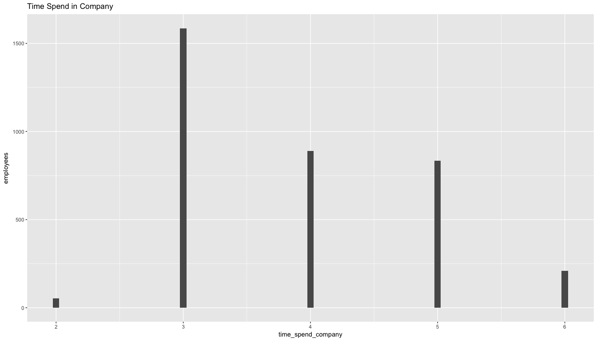

# HR Efficiency Analysis
`r format(Sys.Date())`  


## Problem
###Factors important to retain performing employees
Why are our best and most experienced employees leaving prematurely? Can we predict which valuable employees will leave next?

## Data Source
https://www.kaggle.com/ludobenistant/hr-analytics

https://www.kaggle.com/ludobenistant/hr-analytics/downloads/human-resources-analytics.zip

Lets load the dataset

```r
  hr <- read.csv("./HR_comma_sep.csv", header = TRUE)
```

Lets look at the fields in the dataset

```r
  names(hr)
```

```
##  [1] "satisfaction_level"    "last_evaluation"      
##  [3] "number_project"        "average_montly_hours" 
##  [5] "time_spend_company"    "Work_accident"        
##  [7] "left"                  "promotion_last_5years"
##  [9] "sales"                 "salary"
```

Lets analyze the structure of dataset

```r
  str(hr)
```

```
## 'data.frame':	14999 obs. of  10 variables:
##  $ satisfaction_level   : num  0.38 0.8 0.11 0.72 0.37 0.41 0.1 0.92 0.89 0.42 ...
##  $ last_evaluation      : num  0.53 0.86 0.88 0.87 0.52 0.5 0.77 0.85 1 0.53 ...
##  $ number_project       : int  2 5 7 5 2 2 6 5 5 2 ...
##  $ average_montly_hours : int  157 262 272 223 159 153 247 259 224 142 ...
##  $ time_spend_company   : int  3 6 4 5 3 3 4 5 5 3 ...
##  $ Work_accident        : int  0 0 0 0 0 0 0 0 0 0 ...
##  $ left                 : int  1 1 1 1 1 1 1 1 1 1 ...
##  $ promotion_last_5years: int  0 0 0 0 0 0 0 0 0 0 ...
##  $ sales                : Factor w/ 10 levels "accounting","hr",..: 8 8 8 8 8 8 8 8 8 8 ...
##  $ salary               : Factor w/ 3 levels "high","low","medium": 2 3 3 2 2 2 2 2 2 2 ...
```
####Observations
* Fields _number_project_, _promotion_last_5years_, _left_, _Work_accident_ maybe factors.
* Also field _sales_ does not seems to have sales figures but departments that employee belongs to.

Lets look at the summary of the data set

```r
  summary(hr)
```

```
##  satisfaction_level last_evaluation  number_project  average_montly_hours
##  Min.   :0.0900     Min.   :0.3600   Min.   :2.000   Min.   : 96.0       
##  1st Qu.:0.4400     1st Qu.:0.5600   1st Qu.:3.000   1st Qu.:156.0       
##  Median :0.6400     Median :0.7200   Median :4.000   Median :200.0       
##  Mean   :0.6128     Mean   :0.7161   Mean   :3.803   Mean   :201.1       
##  3rd Qu.:0.8200     3rd Qu.:0.8700   3rd Qu.:5.000   3rd Qu.:245.0       
##  Max.   :1.0000     Max.   :1.0000   Max.   :7.000   Max.   :310.0       
##                                                                          
##  time_spend_company Work_accident         left       
##  Min.   : 2.000     Min.   :0.0000   Min.   :0.0000  
##  1st Qu.: 3.000     1st Qu.:0.0000   1st Qu.:0.0000  
##  Median : 3.000     Median :0.0000   Median :0.0000  
##  Mean   : 3.498     Mean   :0.1446   Mean   :0.2381  
##  3rd Qu.: 4.000     3rd Qu.:0.0000   3rd Qu.:0.0000  
##  Max.   :10.000     Max.   :1.0000   Max.   :1.0000  
##                                                      
##  promotion_last_5years         sales         salary    
##  Min.   :0.00000       sales      :4140   high  :1237  
##  1st Qu.:0.00000       technical  :2720   low   :7316  
##  Median :0.00000       support    :2229   medium:6446  
##  Mean   :0.02127       IT         :1227                
##  3rd Qu.:0.00000       product_mng: 902                
##  Max.   :1.00000       marketing  : 858                
##                        (Other)    :2923
```
####Observations
* All fields in the dataset have non-NA values. 
* _sales_ seems to have _(other)_

Lets look at all unique values for field 'sales'. Looks like 'sales' have values.

```r
unique(hr$sales)
```

```
##  [1] sales       accounting  hr          technical   support    
##  [6] management  IT          product_mng marketing   RandD      
## 10 Levels: accounting hr IT management marketing product_mng ... technical
```
## Data Wrangling

Lets make fields _number_project_, _promotion_last_5years_, _left_, _Work_accident_ as factors

```r
  hr$number_project <-
    as.factor(hr$number_project)
    hr$promotion_last_5years <-
    as.factor(hr$promotion_last_5years)
    hr$left <- as.factor(hr$left)
    hr$Work_accident <-
    as.factor(hr$Work_accident)
```

Rename the _sales_ field to _dept_

```r
  names(hr)[9] <- "dept"
```

Lets look are structure once again

```r
  str(hr)
```

```
## 'data.frame':	14999 obs. of  10 variables:
##  $ satisfaction_level   : num  0.38 0.8 0.11 0.72 0.37 0.41 0.1 0.92 0.89 0.42 ...
##  $ last_evaluation      : num  0.53 0.86 0.88 0.87 0.52 0.5 0.77 0.85 1 0.53 ...
##  $ number_project       : Factor w/ 6 levels "2","3","4","5",..: 1 4 6 4 1 1 5 4 4 1 ...
##  $ average_montly_hours : int  157 262 272 223 159 153 247 259 224 142 ...
##  $ time_spend_company   : int  3 6 4 5 3 3 4 5 5 3 ...
##  $ Work_accident        : Factor w/ 2 levels "0","1": 1 1 1 1 1 1 1 1 1 1 ...
##  $ left                 : Factor w/ 2 levels "0","1": 2 2 2 2 2 2 2 2 2 2 ...
##  $ promotion_last_5years: Factor w/ 2 levels "0","1": 1 1 1 1 1 1 1 1 1 1 ...
##  $ dept                 : Factor w/ 10 levels "accounting","hr",..: 8 8 8 8 8 8 8 8 8 8 ...
##  $ salary               : Factor w/ 3 levels "high","low","medium": 2 3 3 2 2 2 2 2 2 2 ...
```

## Data Exploration

Lets analyze _satisfaction_level_, _time_spend_company_, _last_evaluation_, _average_monthly_hours_, _work_accident_, _salary_ and _number_project_


```r
hr_left <- hr %>% filter(left == 1)
par(mfrow = c(1, 3))
hist(hr_left$satisfaction_level, col = "#3090C7", main = "Satisfaction level")

hist(hr_left$last_evaluation, col = "#3090C7", main = "Last evaluation")

hist(hr_left$average_montly_hours,
col = "#3090C7",
main = "Average montly hours")
```

<!-- -->

```r
hist(as.numeric(hr_left$Work_accident),
col = "#3090C7",
main = "Work accident")
plot(hr_left$salary, col = "#3090C7", main = "Salary")
hist(as.numeric(hr_left$number_project),
col = "#3090C7",
main = "Number of projects")
```

<!-- -->


##Regression Model

###Linear Regression
Lets build a model to determine how long an employee will stay

####Train Data

```r
set.seed(3456)
trainIndex <- createDataPartition(hr$time_spend_company, p = .8, 
                                  list = FALSE, 
                                  times = 1)
head(trainIndex)
```

```
##      Resample1
## [1,]         1
## [2,]         2
## [3,]         3
## [4,]         4
## [5,]         6
## [6,]         7
```

```r
hrTrain <- hr[ trainIndex,]
```
###Test Data

```r
hrTest  <- hr[-trainIndex,]
```

###Models


```r
lm_time_spend_mthly_hrs<- lm(time_spend_company~left+number_project+last_evaluation+average_montly_hours+salary+Work_accident+satisfaction_level, data = hrTrain)
```


```r
lm_time_spend <- lm(time_spend_company~left+number_project+last_evaluation+salary+Work_accident+satisfaction_level, data = hrTrain)
```

###Annova for the model

```r
anova(lm_time_spend_mthly_hrs,lm_time_spend)
```

```
## Analysis of Variance Table
## 
## Model 1: time_spend_company ~ left + number_project + last_evaluation + 
##     average_montly_hours + salary + Work_accident + satisfaction_level
## Model 2: time_spend_company ~ left + number_project + last_evaluation + 
##     salary + Work_accident + satisfaction_level
##   Res.Df   RSS Df Sum of Sq      F   Pr(>F)   
## 1  11987 23606                                
## 2  11988 23623 -1   -16.059 8.1545 0.004303 **
## ---
## Signif. codes:  0 '***' 0.001 '**' 0.01 '*' 0.05 '.' 0.1 ' ' 1
```

###Predict using the model _lm_time_spend_mthly_hrs_

```r
predict_lm_emp_leaving <- predict(lm_time_spend_mthly_hrs, newdata = hrTest)
#summary of prediction
summary(predict_lm_emp_leaving)
```

```
##    Min. 1st Qu.  Median    Mean 3rd Qu.    Max. 
##   2.479   3.265   3.410   3.513   3.671   4.949
```

```r
#summary of actuals
summary(hrTest$time_spend_company)
```

```
##    Min. 1st Qu.  Median    Mean 3rd Qu.    Max. 
##   2.000   3.000   3.000   3.491   4.000  10.000
```

```r
#lets see how good the model prediction was

#Sum of squared errors(SSE)
sse = sum((hrTest$time_spend_company - predict_lm_emp_leaving ) ^ 2)
round(sse, digits = 2)
```

```
## [1] 5953.67
```

```r
#Total sum of squares(SST)
sst = sum((hrTest$time_spend_company - mean(hrTrain$time_spend_company) ) ^ 2)
round(sst, digits = 4)
```

```
## [1] 6399.75
```

```r
#R-Squared 
r_squared = 1 - sse / sst
round(r_squared, digits = 4)
```

```
## [1] 0.0697
```

```r
#Root mean squared errors (RMSE)
rmse = sqrt(sse / nrow(hrTest))
round(rmse, digits = 4)
```

```
## [1] 1.409
```


