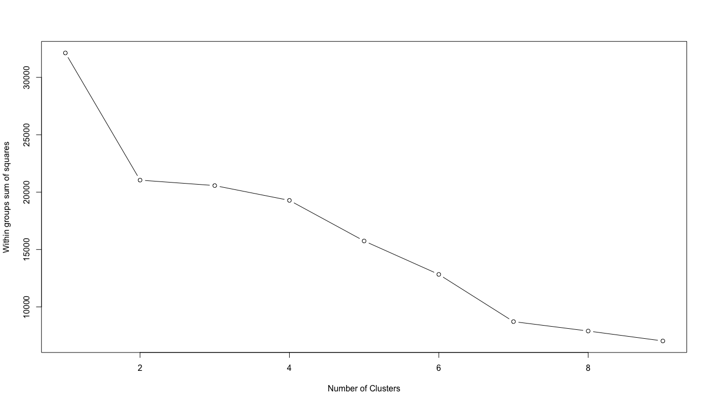
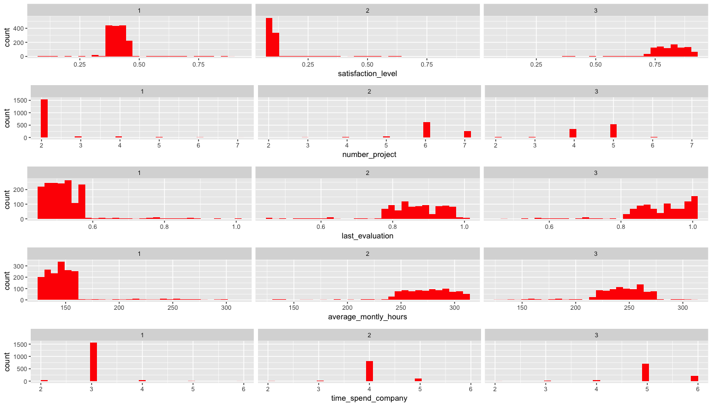

# HR Efficiency Analysis
`r format(Sys.Date())`  


## Problem
###Factors important to retain performing employees
* We will be analysing the data available in hand to identify avenues to improving hr efficiency.
* We will be building a predictive model to determine how long employee would stay and their probability in leaving.

## Data Source
https://www.kaggle.com/ludobenistant/hr-analytics

https://www.kaggle.com/ludobenistant/hr-analytics/downloads/human-resources-analytics.zip

#####Lets load the dataset

```r
hr <- read.csv("./HR_comma_sep.csv", 
               header = TRUE, 
               stringsAsFactors = FALSE)

summary(hr)
```

```
##  satisfaction_level last_evaluation  number_project  average_montly_hours
##  Min.   :0.0900     Min.   :0.3600   Min.   :2.000   Min.   : 96.0       
##  1st Qu.:0.4400     1st Qu.:0.5600   1st Qu.:3.000   1st Qu.:156.0       
##  Median :0.6400     Median :0.7200   Median :4.000   Median :200.0       
##  Mean   :0.6128     Mean   :0.7161   Mean   :3.803   Mean   :201.1       
##  3rd Qu.:0.8200     3rd Qu.:0.8700   3rd Qu.:5.000   3rd Qu.:245.0       
##  Max.   :1.0000     Max.   :1.0000   Max.   :7.000   Max.   :310.0       
##  time_spend_company Work_accident         left       
##  Min.   : 2.000     Min.   :0.0000   Min.   :0.0000  
##  1st Qu.: 3.000     1st Qu.:0.0000   1st Qu.:0.0000  
##  Median : 3.000     Median :0.0000   Median :0.0000  
##  Mean   : 3.498     Mean   :0.1446   Mean   :0.2381  
##  3rd Qu.: 4.000     3rd Qu.:0.0000   3rd Qu.:0.0000  
##  Max.   :10.000     Max.   :1.0000   Max.   :1.0000  
##  promotion_last_5years    sales              salary         
##  Min.   :0.00000       Length:14999       Length:14999      
##  1st Qu.:0.00000       Class :character   Class :character  
##  Median :0.00000       Mode  :character   Mode  :character  
##  Mean   :0.02127                                            
##  3rd Qu.:0.00000                                            
##  Max.   :1.00000
```

* _satisfaction_level_ - Employee Level of satisfaction. It ranges from __0 (low satisfaction)__ to __1 (high satisfaction)__
* _last_evaluation_ - Latest performance evaluation rating of employee. It ranges from __0 (low rating)__ to __1 (high rating)__
* _number_project_ - Number of projects completed while at work. It varies from __2__ to __7__ projects, on an average an employee has worked on __4__ projects.
* _average_montly_hours_ - Average monthly work hours at workplace. It varies from __96 hrs__ to __310 hrs__ with a mean of __201 hrs__ per month.
* _time_spend_company_ - Number of years spent in the company. It ranges from __2__ years to __10__ years, with an average of around __4__ years until now or until they left.
* _Work_accident_ - Whether the employee had a workplace accident
* _left_ - Whether the employee left the workplace or not. __1__ means __left__ and __0__ means still with company. Probability of leaving is __0.23__.
* _promotion_last_5years_ - Whether the employee was promoted in the last five years. __1__ means promoted and __0__ means no promotion in last 5 years. Probability of promotion in last 5 years is __0.02__.


* _sales_ - Department in which they work for. _accounting_, _hr_, _IT_, _management_,  _marketing_, _product_mng_, _RandD_, _sales_, _support_, _technical_ are various departments employees belong to.

```r
summary(as.factor(hr$sales))
```

```
##  accounting          hr          IT  management   marketing product_mng 
##         767         739        1227         630         858         902 
##       RandD       sales     support   technical 
##         787        4140        2229        2720
```

* _salary_ - Salary as high, medium & low.

```r
summary(as.factor(hr$salary))
```

```
##   high    low medium 
##   1237   7316   6446
```

* Fields _number_project_, _promotion_last_5years_, _left_, _Work_accident_, _sales_,_salary_ have discrete values.
* Looking at the summary of the data set there are no bad data , 'blanks', 'NA', null etc.

## Data Wrangling

Rename the _sales_ column to _dept_ and make columns _number_project_, _promotion_last_5years_, _left_, _Work_accident_, _sales_,_salary_ as factor

```r
hr$number_project <- as.factor(hr$number_project)
hr$promotion_last_5years <- as.factor(hr$promotion_last_5years)
hr$left <- as.factor(hr$left)
hr$Work_accident <- as.factor(hr$Work_accident)
hr$sales <- as.factor(hr$sales)
hr$salary <- as.factor(hr$salary)

names(hr)[9] <- "dept"
```

Lets look are structure

```r
  str(hr)
```

```
## 'data.frame':	14999 obs. of  10 variables:
##  $ satisfaction_level   : num  0.38 0.8 0.11 0.72 0.37 0.41 0.1 0.92 0.89 0.42 ...
##  $ last_evaluation      : num  0.53 0.86 0.88 0.87 0.52 0.5 0.77 0.85 1 0.53 ...
##  $ number_project       : Factor w/ 6 levels "2","3","4","5",..: 1 4 6 4 1 1 5 4 4 1 ...
##  $ average_montly_hours : int  157 262 272 223 159 153 247 259 224 142 ...
##  $ time_spend_company   : int  3 6 4 5 3 3 4 5 5 3 ...
##  $ Work_accident        : Factor w/ 2 levels "0","1": 1 1 1 1 1 1 1 1 1 1 ...
##  $ left                 : Factor w/ 2 levels "0","1": 2 2 2 2 2 2 2 2 2 2 ...
##  $ promotion_last_5years: Factor w/ 2 levels "0","1": 1 1 1 1 1 1 1 1 1 1 ...
##  $ dept                 : Factor w/ 10 levels "accounting","hr",..: 8 8 8 8 8 8 8 8 8 8 ...
##  $ salary               : Factor w/ 3 levels "high","low","medium": 2 3 3 2 2 2 2 2 2 2 ...
```

## Data Exploration

Lets look at correaltion between these various columns


```r
hr %>%  dplyr::select(
  satisfaction_level,
  last_evaluation,
  average_montly_hours,
  number_project,
  left
  ) %>% ggpairs()
```

<!-- -->

###__number_project__ 
* employees involved in 3-5 projects have high satisfaction level, less than 3 projects or more than 5 projects satisfaction is low
* last_evaluation increases with number_project
* average_monthly_hours also increases with number_project
* number of employees leaving (left=1) is high at 2 or less improves for 3 projects and then slowly creeps up until 5 projects and goes down
* Overall Looks like 3-5 projects would mean less employees quiting and good employee satisfaction.

###__average_monthly_hours__
* relation to satisfaction or last_evaluation is not very obvious
* average_monthly_hours seems to increase with number_project
* employees leaving (left=1)
  + 150 hours +/- 25 shows high number of employees leaving
	+ Again 225 hours and more employees leaving creaps to peak at around 250 hours and dips gradually to 300 hours
	+ 175 hours - 225 hours for average_monthly_hours seems to have low rate of employees leaving

###__last_evaluation__
* Between 0.4 to 0.6 evaluation rating, employees leaving (left=1) is high.
* It goes down at mid level and then picks up at around 0.75 and peaks around 0.85
* So low and higher end of evaluation rating employees leaving is high.
* Though one's leaving at lower rating is good for the company but the employees leaving having high rating is a concern for the company. 	
	
###__satisfaction_level__
* number projects between 3-5 show high satisfaction, less projects or too many projects tend to lower satisfaction
* employees leaving have lower satisfaction than employees not leaving the company

###__overall__
Looks like employees involved in 3 -5 projects and putting in 175 hours - 225 hours average monthly hours have lower rate of leaving company and have high satisfaction level.


```r
hr %>%  dplyr::select(Work_accident, promotion_last_5years, salary, left) %>% ggpairs()
```

<!-- -->

###__Work_accident__
* A small percent of employees involved in Work_accident are actually leaving company. Either Work_accident is not a very significant accident.
* Work_accident is higher at medium and low salary level than in higher salary level

###__promotion_last_5years__
* Very few employees are getting promoted
* number of employees getting promoted are even at different salary level.

###__salary__
* Higher number of employees leaving are in the medium & low salary level

###__overall__
Work_accident, promotion_last_5years & salary dont seem to have significant impact on employees leaving company.


Lets analyze _satisfaction_level_, _time_spend_company_, _last_evaluation_, _average_monthly_hours_ and _number_project_


```r
satis_l <- hr %>% ggplot(aes(satisfaction_level)) +
  geom_histogram( binwidth = 0.05, aes(fill = left)) +
  labs(x = "satisfaction_level", y = "employees", title = "satisfaction level") + myTheme

nmbr_prj <- hr %>% ggplot(aes(as.numeric(number_project))) +
  geom_histogram( binwidth = 1, aes(fill = left)) +
  labs(x = "number_project", y = "employees", title = "Number of projects") + myTheme

lst_eval <- hr %>% ggplot(aes(last_evaluation)) +
  geom_histogram( binwidth = 0.05, aes(fill = left)) +
  labs(x = "last_evaluation", y = "employees", title = "Last evaluation") + myTheme

mnthly_hrs <- hr %>% ggplot(aes(average_montly_hours)) +
  geom_histogram( binwidth = 1, aes(fill = left)) +
  labs(x = "average_montly_hours", y = "employees", title = "Average montly hours") + myTheme

tm_spnd <- hr %>% ggplot(aes(time_spend_company)) +
  geom_histogram( binwidth = 1, aes(fill = left)) +
  labs(x = "time_spend_company", y = "employees", title = "Time Spend in Company") + myTheme


grid.arrange(satis_l, nmbr_prj, lst_eval, mnthly_hrs,tm_spnd,  nrow = 3)
```

<!-- -->

* Using plots for __satisfaction_level__, __avaerage_monthly_hours__, __last_evaluation__ & __number_projects__:
  + Overall lower performing employees are leaving more. This warrants improvement in hiring process to avoid low performers
  + Aside from low performers, we can notice number of employees leaving creeeping up among mid to high performing. This is an area that needs to be also looked into for reduction in rate of attrition.  
  + Looks like employees involved in 3 -5 projects and putting in 175 hours - 225 hours average monthly hours have lower rate of leaving company and have high satisfaction level.


###Cluster Analysis 

```r
#lets identify optimum number of clusters
wssplot <- function(data, nc = 15, seed = 1234) {
  wss <- (nrow(data) - 1) * sum(apply(data, 2, var))
  for (i in 2:nc) {
    set.seed(seed)
    wss[i] <- sum(kmeans(data, centers = i)$withinss)
  }
  plot(1:nc,
       wss,
       type = "b",
       xlab = "Number of Clusters",
       ylab = "Within groups sum of squares")   
}

#lets consider employees who left the company
hr_clust <- hr %>% filter(left == 1)

#remove attribute left
hr_clust <- hr_clust[-7]

#lets make all fields numeric
hr_clust$dept <- as.numeric( as.factor(hr_clust$dept))
hr_clust$salary <- as.numeric( as.factor(hr_clust$salary))
hr_clust$number_project <- as.numeric( hr_clust$number_project)
hr_clust$Work_accident <- as.numeric( hr_clust$Work_accident)
hr_clust$promotion_last_5years <- as.numeric(hr_clust$promotion_last_5years)

#lets identify optimum number of clusters
wssplot(scale(hr_clust))
```

<!-- -->


```r
# lets consider 3 clusters 

fit.km <- kmeans(scale(hr_clust), 3)
clusplot(hr_clust,fit.km$cluster, color = TRUE)
```

<!-- -->


```r
cluster_analysis <- cbind(hr_clust,fit.km$cluster)
names(cluster_analysis)[10] <- 'cluster'

satis_2 <- cluster_analysis %>% 
  ggplot(aes(satisfaction_level)) + 
  geom_histogram(fill = "red") + 
  facet_grid(.~cluster)

num_prj2 <- cluster_analysis %>% 
  ggplot(aes(number_project)) + 
  geom_histogram(fill = "red") + 
  facet_grid(.~cluster)

last_eval2 <- cluster_analysis %>% 
  ggplot(aes(last_evaluation)) + 
  geom_histogram(fill = "red") + 
  facet_grid(.~cluster)

avg_hrs2 <- cluster_analysis %>% 
  ggplot(aes(average_montly_hours)) + 
  geom_histogram(fill = "red") + 
  facet_grid(.~cluster)

grid.arrange(satis_2, num_prj2, last_eval2, avg_hrs2, nrow = 4)
```

<!-- -->

###__cluster 1__
* Employees having overall higher satisfaction level, 
* involved 3-5 projects, 
* higher evaluation rating (0.8 -1) and 
* average monthly hours of 225  - 275 hours.

###__cluster 2__
* Employees having overall medium satisfaction level, 
* involved in less than 2 projects, 
* low to medium evaluation rating (<0.6) and 
* low average monthly hours of less than 175 hours.

###__cluster 3__
* Employees having overall low satisfaction level, 
* involved in more than 4 projects, 
* high evaluation rating (0.8-1) and 
* high average monthly hours of 225 - 350 hours.

###__overall__
* cluster 1 are employees that comapany need to find ways to retain.
* cluster 3 are over worked employees, company need to find ways to optimise work load and improve satisfaction level
* cluster 2 are under performing employees and company need to focus to minimize hiring employees of this category.


```r
promotion2 <- cluster_analysis %>% 
  ggplot(aes(promotion_last_5years)) + 
  geom_histogram(fill = "red") + 
  facet_grid(.~cluster)

dept2 <- cluster_analysis %>% 
  ggplot(aes(dept)) + 
  geom_histogram(fill = "red") + 
  facet_grid(.~cluster)

wrk_accdnt2 <- cluster_analysis %>% 
  ggplot(aes(Work_accident)) + 
  geom_histogram(fill = "red") + 
  facet_grid(.~cluster)

sal2 <- cluster_analysis %>% 
  ggplot(aes(salary)) + 
  geom_histogram(fill = "red") + 
  facet_grid(.~cluster)

grid.arrange(promotion2,dept2, wrk_accdnt2, sal2, nrow = 4)
```

<!-- -->

###__overall__
All clusters have even distribution for promotion, department, work accident and salary. Not much significant observation that can be made.

##Regression Model

###Linear Regression
Lets build a model to determine how long an employee will stay using data from employees who already left


####Train Data

```r
set.seed(3456)
hr_left <- hr %>% filter(left==1)
trainIndex <- createDataPartition(hr_left$time_spend_company, p = .8, 
                                  list = FALSE, 
                                  times = 1)
head(trainIndex)
```

```
##      Resample1
## [1,]         1
## [2,]         2
## [3,]         3
## [4,]         4
## [5,]         5
## [6,]         6
```

```r
hrTrain <- hr_left[ trainIndex,]
```
###Test Data

```r
hrTest  <- hr_left[-trainIndex,]
```

###Models
####Lets use caret package to anlyze significant fields for linear model

```r
plot(varImp(train(time_spend_company ~ ., data = hrTrain, method = "lm")))
```

<!-- -->
Attributes satisfaction_level,number_project, avaerage_monthly_hours,promotion_last_5years, dept seems to be significant for linear regression

```r
lm_time_spend <- lm(time_spend_company~ satisfaction_level+number_project+ average_montly_hours+promotion_last_5years+ dept, data = hrTrain)
lm_time_spend_summary <- summary(lm_time_spend)
lm_time_spend_summary
```

```
## 
## Call:
## lm(formula = time_spend_company ~ satisfaction_level + number_project + 
##     average_montly_hours + promotion_last_5years + dept, data = hrTrain)
## 
## Residuals:
##     Min      1Q  Median      3Q     Max 
## -3.2747 -0.1113 -0.0360  0.0444  2.1762 
## 
## Coefficients:
##                          Estimate Std. Error t value Pr(>|t|)    
## (Intercept)             1.8990244  0.0713618  26.611  < 2e-16 ***
## satisfaction_level      1.5310239  0.0726754  21.067  < 2e-16 ***
## number_project3         0.4713017  0.0704442   6.690 2.67e-11 ***
## number_project4         1.0179815  0.0527699  19.291  < 2e-16 ***
## number_project5         1.1575926  0.0499497  23.175  < 2e-16 ***
## number_project6         1.0900318  0.0526000  20.723  < 2e-16 ***
## number_project7         1.1077086  0.0607383  18.237  < 2e-16 ***
## average_montly_hours    0.0032762  0.0003426   9.562  < 2e-16 ***
## promotion_last_5years1 -0.3212174  0.1195740  -2.686  0.00727 ** 
## depthr                  0.0110486  0.0541106   0.204  0.83822    
## deptIT                 -0.0118981  0.0515752  -0.231  0.81757    
## deptmanagement         -0.1528225  0.0708817  -2.156  0.03117 *  
## deptmarketing           0.0911904  0.0555007   1.643  0.10048    
## deptproduct_mng         0.0454856  0.0547072   0.831  0.40580    
## deptRandD               0.0836447  0.0635208   1.317  0.18801    
## deptsales              -0.0074133  0.0426336  -0.174  0.86197    
## deptsupport             0.0558396  0.0456262   1.224  0.22111    
## depttechnical           0.0397286  0.0440389   0.902  0.36707    
## ---
## Signif. codes:  0 '***' 0.001 '**' 0.01 '*' 0.05 '.' 0.1 ' ' 1
## 
## Residual standard error: 0.4886 on 2841 degrees of freedom
## Multiple R-squared:  0.752,	Adjusted R-squared:  0.7505 
## F-statistic: 506.6 on 17 and 2841 DF,  p-value: < 2.2e-16
```


_lm_time_spend_ has an R Squared of 0.7519533 and adjusted R-Squared of 0.750469

#####R-Squared is good for the model.

###Lets predict using the model _lm_time_spend_

```r
predict_time_spend <- predict(lm_time_spend, newdata = hrTest)
#summary of prediction
summary(predict_time_spend)
```

```
##    Min. 1st Qu.  Median    Mean 3rd Qu.    Max. 
##   2.722   3.036   3.997   3.867   4.755   5.358
```

```r
#summary of actuals
summary(hrTest$time_spend_company)
```

```
##    Min. 1st Qu.  Median    Mean 3rd Qu.    Max. 
##   2.000   3.000   4.000   3.874   5.000   6.000
```
The summary shows closeness in prediction to actuals.

###Lets measure the correlation


```r
#correlation data
plot_data <- data.frame(predict_time_spend, hrTest$time_spend_company)
names(plot_data)[1] <- "predicted"
names(plot_data)[2] <- "actual"

#plot_data$predicted <- round(plot_data$predicted)

# plot predicted time spend vs actual time spend in conpany
plot_data %>% ggplot(aes(x = actual, y = predicted)) + geom_point() + geom_smooth(method = "lm")
```

<!-- -->

```r
correlation <- cor(plot_data)
correlation
```

```
##           predicted    actual
## predicted 1.0000000 0.8818467
## actual    0.8818467 1.0000000
```

```r
#correlation
correlation[1,2]
```

```
## [1] 0.8818467
```

The correlation coefficient is excellent __0.8818467__


```r
#lets see how good the model prediction was

#Sum of squared errors(SSE)
sse = sum((hrTest$time_spend_company - predict_time_spend ) ^ 2)
round(sse, digits = 2)
```

```
## [1] 151.2
```

```r
#Root mean squared errors (RMSE)
rmse = sqrt(sse / nrow(hrTest))
round(rmse, digits = 2)
```

```
## [1] 0.46
```
####Linear model _lm_time_spend_ prediction has an 'Root mean squared errors' of 0.46 years and correlation coefficient of 0.88

###Logistic Regression
Lets build a model to predict if the employee will leave

####Train Data

```r
set.seed(3456)
trainIndex <- createDataPartition(hr$left, p = .8, 
                                  list = FALSE, 
                                  times = 1)
head(trainIndex)
```

```
##      Resample1
## [1,]         1
## [2,]         2
## [3,]         3
## [4,]         4
## [5,]         5
## [6,]         6
```

```r
hrTrain <- hr[ trainIndex,]
```
###Test Data

```r
hrTest  <- hr[-trainIndex,]
```

###Models

#####Significant fields


```r
plot(varImp(train(left ~ ., data = hrTrain, method = "bayesglm")))
```

<!-- -->

#####Significant fields
* _satisfaction_level_, _Work_accident_, _salary_, _time_spend_company_, _number_project_, _average_montly_hours_, _promotion_last_5years_, _dept_


```r
log_model <- train( left ~ satisfaction_level + 
                      Work_accident  + 
                      salary + 
                      time_spend_company + 
                      number_project + 
                      average_montly_hours + 
                      promotion_last_5years + 
                      dept, 
                    data = hrTrain, 
                    method = "glm",
                    trControl = trainControl(method = "cv",number = 5))
                           
glm_prediction_train <- predict(log_model, newdata = hrTrain)
glm_confustion_matrix_train <- confusionMatrix(glm_prediction_train,
                                               hrTrain$left,
                                               dnn = c("Predicted", "actual"))
summary(log_model)
```

```
## 
## Call:
## NULL
## 
## Deviance Residuals: 
##     Min       1Q   Median       3Q      Max  
## -2.9545  -0.4487  -0.1973  -0.0479   3.3801  
## 
## Coefficients:
##                          Estimate Std. Error z value Pr(>|z|)    
## (Intercept)            -2.698e+00  2.426e-01 -11.120  < 2e-16 ***
## satisfaction_level     -1.754e+00  1.358e-01 -12.914  < 2e-16 ***
## Work_accident1         -1.544e+00  1.119e-01 -13.795  < 2e-16 ***
## salarylow               2.023e+00  1.578e-01  12.815  < 2e-16 ***
## salarymedium            1.421e+00  1.589e-01   8.944  < 2e-16 ***
## time_spend_company      3.878e-01  2.093e-02  18.528  < 2e-16 ***
## number_project3        -5.145e+00  1.549e-01 -33.213  < 2e-16 ***
## number_project4        -3.474e+00  9.803e-02 -35.441  < 2e-16 ***
## number_project5        -2.502e+00  9.528e-02 -26.253  < 2e-16 ***
## number_project6        -1.984e+00  1.179e-01 -16.832  < 2e-16 ***
## number_project7         1.373e+01  1.597e+02   0.086 0.931496    
## average_montly_hours    1.053e-02  7.031e-04  14.981  < 2e-16 ***
## promotion_last_5years1 -1.555e+00  3.196e-01  -4.865 1.14e-06 ***
## depthr                  2.135e-01  1.776e-01   1.202 0.229217    
## deptIT                 -3.714e-01  1.612e-01  -2.304 0.021196 *  
## deptmanagement         -7.142e-01  2.146e-01  -3.328 0.000874 ***
## deptmarketing          -1.080e-01  1.762e-01  -0.613 0.539990    
## deptproduct_mng        -4.016e-01  1.726e-01  -2.326 0.019994 *  
## deptRandD              -7.509e-01  1.939e-01  -3.872 0.000108 ***
## deptsales              -2.716e-01  1.362e-01  -1.993 0.046214 *  
## deptsupport            -7.137e-02  1.452e-01  -0.491 0.623150    
## depttechnical          -8.169e-02  1.414e-01  -0.578 0.563342    
## ---
## Signif. codes:  0 '***' 0.001 '**' 0.01 '*' 0.05 '.' 0.1 ' ' 1
## 
## (Dispersion parameter for binomial family taken to be 1)
## 
##     Null deviance: 13172.7  on 11999  degrees of freedom
## Residual deviance:  7489.8  on 11978  degrees of freedom
## AIC: 7533.8
## 
## Number of Fisher Scoring iterations: 15
```

```r
glm_confustion_matrix_train
```

```
## Confusion Matrix and Statistics
## 
##          actual
## Predicted    0    1
##         0 8432  953
##         1  711 1904
##                                          
##                Accuracy : 0.8613         
##                  95% CI : (0.855, 0.8675)
##     No Information Rate : 0.7619         
##     P-Value [Acc > NIR] : < 2.2e-16      
##                                          
##                   Kappa : 0.6063         
##  Mcnemar's Test P-Value : 3.463e-09      
##                                          
##             Sensitivity : 0.9222         
##             Specificity : 0.6664         
##          Pos Pred Value : 0.8985         
##          Neg Pred Value : 0.7281         
##              Prevalence : 0.7619         
##          Detection Rate : 0.7027         
##    Detection Prevalence : 0.7821         
##       Balanced Accuracy : 0.7943         
##                                          
##        'Positive' Class : 0              
## 
```


```r
#Lets test prediction using test data 
testPredication <- predict(log_model,hrTest)
glm_confustion_matrix_test <- confusionMatrix(testPredication,hrTest$left, dnn = c("Predicted","actual"))

glm_confustion_matrix_test
```

```
## Confusion Matrix and Statistics
## 
##          actual
## Predicted    0    1
##         0 2098  227
##         1  187  487
##                                           
##                Accuracy : 0.862           
##                  95% CI : (0.8491, 0.8741)
##     No Information Rate : 0.7619          
##     P-Value [Acc > NIR] : < 2e-16         
##                                           
##                   Kappa : 0.612           
##  Mcnemar's Test P-Value : 0.05527         
##                                           
##             Sensitivity : 0.9182          
##             Specificity : 0.6821          
##          Pos Pred Value : 0.9024          
##          Neg Pred Value : 0.7226          
##              Prevalence : 0.7619          
##          Detection Rate : 0.6996          
##    Detection Prevalence : 0.7753          
##       Balanced Accuracy : 0.8001          
##                                           
##        'Positive' Class : 0               
## 
```


```r
library(doMC)
registerDoMC(5)


####Train Data
set.seed(3456)
trainIndex <- createDataPartition(hr$left, p = .8, 
                                  list = FALSE, 
                                  times = 1)
head(trainIndex)
```

```
##      Resample1
## [1,]         1
## [2,]         2
## [3,]         3
## [4,]         4
## [5,]         5
## [6,]         6
```

```r
hrTrain <- hr[ trainIndex,]
hrTest  <- hr[-trainIndex,]

#Create smaller Train data for Random forest
hrTrain_1 <- hrTrain[createDataPartition(y = hrTrain$left,p = 0.3,list = FALSE),]

#Random Forest Model
rf_model <- train(left~.,
                  data = hrTrain_1,
                  method = "rf",
                trControl = trainControl(method = "cv",number = 5),
                pallowParallel = TRUE)

print(rf_model)
```

```
## Random Forest 
## 
## 3601 samples
##    9 predictor
##    2 classes: '0', '1' 
## 
## No pre-processing
## Resampling: Cross-Validated (5 fold) 
## Summary of sample sizes: 2880, 2881, 2882, 2881, 2880 
## Resampling results across tuning parameters:
## 
##   mtry  Accuracy   Kappa    
##    2    0.9519602  0.8585893
##   12    0.9827816  0.9516026
##   22    0.9788947  0.9408412
## 
## Accuracy was used to select the optimal model using  the largest value.
## The final value used for the model was mtry = 12.
```

```r
#prediction on train data
rf_prediction_train = predict(rf_model, newdata = hrTrain)

rf_conf_matrix_train <- confusionMatrix(rf_prediction_train, hrTrain$left)

rf_conf_matrix_train
```

```
## Confusion Matrix and Statistics
## 
##           Reference
## Prediction    0    1
##          0 9129  145
##          1   14 2712
##                                           
##                Accuracy : 0.9868          
##                  95% CI : (0.9845, 0.9887)
##     No Information Rate : 0.7619          
##     P-Value [Acc > NIR] : < 2.2e-16       
##                                           
##                   Kappa : 0.9629          
##  Mcnemar's Test P-Value : < 2.2e-16       
##                                           
##             Sensitivity : 0.9985          
##             Specificity : 0.9492          
##          Pos Pred Value : 0.9844          
##          Neg Pred Value : 0.9949          
##              Prevalence : 0.7619          
##          Detection Rate : 0.7608          
##    Detection Prevalence : 0.7728          
##       Balanced Accuracy : 0.9739          
##                                           
##        'Positive' Class : 0               
## 
```

```r
#prediction on test data
rf_prediction = predict(rf_model, newdata = hrTest)

rf_conf_matrix <- confusionMatrix(rf_prediction, hrTest$left)
rf_conf_matrix
```

```
## Confusion Matrix and Statistics
## 
##           Reference
## Prediction    0    1
##          0 2279   54
##          1    6  660
##                                           
##                Accuracy : 0.98            
##                  95% CI : (0.9743, 0.9847)
##     No Information Rate : 0.7619          
##     P-Value [Acc > NIR] : < 2.2e-16       
##                                           
##                   Kappa : 0.9435          
##  Mcnemar's Test P-Value : 1.298e-09       
##                                           
##             Sensitivity : 0.9974          
##             Specificity : 0.9244          
##          Pos Pred Value : 0.9769          
##          Neg Pred Value : 0.9910          
##              Prevalence : 0.7619          
##          Detection Rate : 0.7599          
##    Detection Prevalence : 0.7779          
##       Balanced Accuracy : 0.9609          
##                                           
##        'Positive' Class : 0               
## 
```


###Summarize Logistics and Randon Forest Regression results

```r
overall <- cbind(
  glm_confustion_matrix_train$overall,
  glm_confustion_matrix_test$overall,
  rf_conf_matrix_train$overall,
  rf_conf_matrix$overall
  )
  
byClass <- cbind(
  glm_confustion_matrix_train$byClass,
  glm_confustion_matrix_test$byClass,
  rf_conf_matrix_train$byClass,
  rf_conf_matrix$byClass
  )
  
all_conf_matrix <- rbind(overall, byClass)
all_conf_matrix <- data.frame(all_conf_matrix)
names(all_conf_matrix) <- c("glm_train", "glm_test", "rf_train", "rf_test")

all_conf_matrix$glm_train <- round(all_conf_matrix$glm_train, digits = 4)
all_conf_matrix$glm_test <- round(all_conf_matrix$glm_test, digits = 4)
all_conf_matrix$rf_train <- round(all_conf_matrix$rf_train, digits = 4)
all_conf_matrix$rf_test <- round(all_conf_matrix$rf_test, digits = 4)

rownames(all_conf_matrix)[3] <- "95% CI (Upper)"
rownames(all_conf_matrix)[4] <- "95% CI (Lower)"
rownames(all_conf_matrix)[5] <- "No Information Rate"
rownames(all_conf_matrix)[6] <- "P-Value [Acc > NIR]"
rownames(all_conf_matrix)[7] <- "Mcnemar's Test P-Value"

all_conf_matrix
```

```
##                        glm_train glm_test rf_train rf_test
## Accuracy                  0.8613   0.8620   0.9868  0.9800
## Kappa                     0.6063   0.6120   0.9629  0.9435
## 95% CI (Upper)            0.8550   0.8491   0.9845  0.9743
## 95% CI (Lower)            0.8675   0.8741   0.9887  0.9847
## No Information Rate       0.7619   0.7619   0.7619  0.7619
## P-Value [Acc > NIR]       0.0000   0.0000   0.0000  0.0000
## Mcnemar's Test P-Value    0.0000   0.0553   0.0000  0.0000
## Sensitivity               0.9222   0.9182   0.9985  0.9974
## Specificity               0.6664   0.6821   0.9492  0.9244
## Pos Pred Value            0.8985   0.9024   0.9844  0.9769
## Neg Pred Value            0.7281   0.7226   0.9949  0.9910
## Precision                 0.8985   0.9024   0.9844  0.9769
## Recall                    0.9222   0.9182   0.9985  0.9974
## F1                        0.9102   0.9102   0.9914  0.9870
## Prevalence                0.7619   0.7619   0.7619  0.7619
## Detection Rate            0.7027   0.6996   0.7608  0.7599
## Detection Prevalence      0.7821   0.7753   0.7728  0.7779
## Balanced Accuracy         0.7943   0.8001   0.9739  0.9609
```


