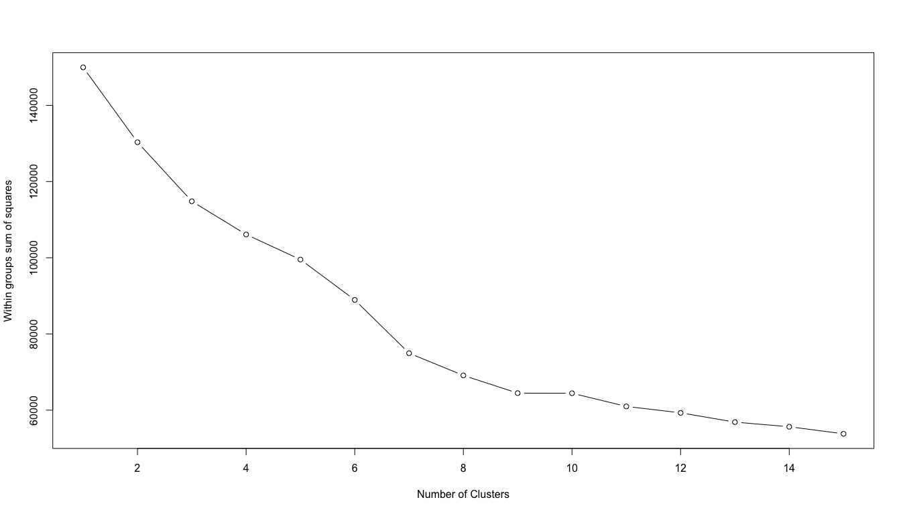

# HR Efficiency Analysis
`r format(Sys.Date())`  


## Problem
###Factors important to retain performing employees
* Why are our best and most experienced employees leaving prematurely? 
We will analysing the data available in hand to identify avenues to improving hr efficiency.
* Can we predict which valuable employees will leave next?
We will be building a predictive model to determine how long employee would stay and their probability in leaving.

## Data Source
https://www.kaggle.com/ludobenistant/hr-analytics

https://www.kaggle.com/ludobenistant/hr-analytics/downloads/human-resources-analytics.zip

Lets load the dataset

```r
  hr <- read.csv("./HR_comma_sep.csv", header = TRUE, stringsAsFactors = FALSE)
```

#####Lets look at the fields in the dataset

* _satisfaction_level_ - Level of satisfaction (0-1)
* _last_evaluation_ - Evaluation of employee performance (0-1)
* _number_project_ - Number of projects completed while at work
* _average_montly_hours_ - Average monthly hours at workplace
* _time_spend_company_ - Number of years spent in the company
* _Work_accident_ - Whether the employee had a workplace accident
* _left_ - Whether the employee left the workplace or not (1 or 0) 
* _promotion_last_5years_ - Whether the employee was promoted in the last five years
* _sales_ - Department in which they work for
* _salary_ - Salary (High, medium, Low)

Lets analyze the structure of dataset

```r
str(hr)
```

```
## 'data.frame':	14999 obs. of  10 variables:
##  $ satisfaction_level   : num  0.38 0.8 0.11 0.72 0.37 0.41 0.1 0.92 0.89 0.42 ...
##  $ last_evaluation      : num  0.53 0.86 0.88 0.87 0.52 0.5 0.77 0.85 1 0.53 ...
##  $ number_project       : int  2 5 7 5 2 2 6 5 5 2 ...
##  $ average_montly_hours : int  157 262 272 223 159 153 247 259 224 142 ...
##  $ time_spend_company   : int  3 6 4 5 3 3 4 5 5 3 ...
##  $ Work_accident        : int  0 0 0 0 0 0 0 0 0 0 ...
##  $ left                 : int  1 1 1 1 1 1 1 1 1 1 ...
##  $ promotion_last_5years: int  0 0 0 0 0 0 0 0 0 0 ...
##  $ sales                : chr  "sales" "sales" "sales" "sales" ...
##  $ salary               : chr  "low" "medium" "medium" "low" ...
```

####Observations
* Fields _number_project_, _promotion_last_5years_, _left_, _Work_accident_, _sales_ have discrete values.


```r
str(as.factor(hr$salary))
```

```
##  Factor w/ 3 levels "high","low","medium": 2 3 3 2 2 2 2 2 2 2 ...
```

####Observations
* Field _salary_ is also discrete with "high", "medium" & "low". Also looks like "low" is assigned 2, "medium" is assigned 3 and "high" is assigned 1.

Lets look at all unique values for field 'sales'.

```r
unique(hr$sales)
```

```
##  [1] "sales"       "accounting"  "hr"          "technical"   "support"    
##  [6] "management"  "IT"          "product_mng" "marketing"   "RandD"
```

####Observations
* Field _sales_ does not seems to have sales figures but departments that employee belongs to.


Lets look at the summary of the data set to see if there are no invalid data

```r
  summary(hr)
```

```
##  satisfaction_level last_evaluation  number_project  average_montly_hours
##  Min.   :0.0900     Min.   :0.3600   Min.   :2.000   Min.   : 96.0       
##  1st Qu.:0.4400     1st Qu.:0.5600   1st Qu.:3.000   1st Qu.:156.0       
##  Median :0.6400     Median :0.7200   Median :4.000   Median :200.0       
##  Mean   :0.6128     Mean   :0.7161   Mean   :3.803   Mean   :201.1       
##  3rd Qu.:0.8200     3rd Qu.:0.8700   3rd Qu.:5.000   3rd Qu.:245.0       
##  Max.   :1.0000     Max.   :1.0000   Max.   :7.000   Max.   :310.0       
##  time_spend_company Work_accident         left       
##  Min.   : 2.000     Min.   :0.0000   Min.   :0.0000  
##  1st Qu.: 3.000     1st Qu.:0.0000   1st Qu.:0.0000  
##  Median : 3.000     Median :0.0000   Median :0.0000  
##  Mean   : 3.498     Mean   :0.1446   Mean   :0.2381  
##  3rd Qu.: 4.000     3rd Qu.:0.0000   3rd Qu.:0.0000  
##  Max.   :10.000     Max.   :1.0000   Max.   :1.0000  
##  promotion_last_5years    sales              salary         
##  Min.   :0.00000       Length:14999       Length:14999      
##  1st Qu.:0.00000       Class :character   Class :character  
##  Median :0.00000       Mode  :character   Mode  :character  
##  Mean   :0.02127                                            
##  3rd Qu.:0.00000                                            
##  Max.   :1.00000
```
####Observations
* All fields in the dataset have non-NA values. 


## Data Wrangling

Rename the _sales_ field to _dept_ and create seperate field salary_level 3: High, 2: Medium & 1: low

```r
names(hr)[9] <- "dept"
hr <- hr %>% mutate(salary_level = case_when(
  .$salary == "high" ~ 3, 
  .$salary == "medium" ~ 2, 
  .$salary == "low" ~ 1))
```

Lets look are structure once again

```r
  str(hr)
```

```
## 'data.frame':	14999 obs. of  11 variables:
##  $ satisfaction_level   : num  0.38 0.8 0.11 0.72 0.37 0.41 0.1 0.92 0.89 0.42 ...
##  $ last_evaluation      : num  0.53 0.86 0.88 0.87 0.52 0.5 0.77 0.85 1 0.53 ...
##  $ number_project       : int  2 5 7 5 2 2 6 5 5 2 ...
##  $ average_montly_hours : int  157 262 272 223 159 153 247 259 224 142 ...
##  $ time_spend_company   : int  3 6 4 5 3 3 4 5 5 3 ...
##  $ Work_accident        : int  0 0 0 0 0 0 0 0 0 0 ...
##  $ left                 : int  1 1 1 1 1 1 1 1 1 1 ...
##  $ promotion_last_5years: int  0 0 0 0 0 0 0 0 0 0 ...
##  $ dept                 : chr  "sales" "sales" "sales" "sales" ...
##  $ salary               : chr  "low" "medium" "medium" "low" ...
##  $ salary_level         : num  1 2 2 1 1 1 1 1 1 1 ...
```

## Data Exploration

Lets analyze _satisfaction_level_, _time_spend_company_, _last_evaluation_, _average_monthly_hours_, _work_accident_, _salary_ and _number_project_


```r
hr_left <- hr %>% filter(left == 1)

satis_l <- hr_left %>% ggplot(aes(satisfaction_level)) +
  geom_histogram( binwidth = 0.05, aes(fill = ..count..)) +
  scale_fill_gradient("Count", low = "green", high = "red") +
  labs(x = "satisfaction_level", y = "employees", title = "satisfaction level") + myTheme

tm_spnd <- hr_left %>% ggplot(aes(time_spend_company)) +
  geom_histogram( binwidth = 0.05, aes(fill = ..count..)) +
  scale_fill_gradient("Count", low = "green", high = "red") +
  labs(x = "time_spend_company", y = "employees", title = "Time Spend in Company") + myTheme

lst_eval <- hr_left %>% ggplot(aes(last_evaluation)) +
  geom_histogram( binwidth = 0.05, aes(fill = ..count..)) +
  scale_fill_gradient("Count", low = "green", high = "red") +
  labs(x = "last_evaluation", y = "employees", title = "Last evaluation") + myTheme

mnthly_hrs <- hr_left %>% ggplot(aes(average_montly_hours)) +
  geom_histogram( binwidth = 0.05, aes(fill = ..count..)) +
  scale_fill_gradient("Count", low = "green", high = "red") +
  labs(x = "average_montly_hours", y = "employees", title = "Average montly hours") + myTheme

wrk_accdnt <- hr_left %>% ggplot(aes(Work_accident)) +
  geom_histogram( binwidth = 0.05, aes(fill = ..count..)) +
  scale_fill_gradient("Count", low = "green", high = "red") +
  labs(x = "Work_accident", y = "employees", title = "Work accident") + myTheme

sal <- hr_left %>% ggplot(aes(salary_level)) +
  geom_histogram( binwidth = 0.05, aes(fill = ..count..)) +
  scale_fill_gradient("Count", low = "green", high = "red") +
  labs(x = "salary", y = "employees", title = "Salary") + myTheme

nmbr_prj <- hr_left %>% ggplot(aes(as.numeric(number_project))) +
  geom_histogram( binwidth = 0.05, aes(fill = ..count..)) +
  scale_fill_gradient("Count", low = "green", high = "red") +
  labs(x = "number_project", y = "employees", title = "Number of projects") + myTheme

grid.arrange(satis_l, tm_spnd, lst_eval,mnthly_hrs,wrk_accdnt,sal,nmbr_prj, nrow = 4)
```

<!-- -->

####Notice high number of employees leaving the company 
* had been with company for less than 3 years
* had an evaluation rating less than 0.5
* had an average monthly hours in work at less than 170 hrs
* had 2 projects or less
* Overall lower performing employees are leaving more. This warrants improvement in hiring process to avoid low performers
* Aside from low performers, we can notice number of employees leaving creeeping up among mid to high performing. This is an area that needs to be also looked into for reduction in rate of attrition.  


##Regression Model

###Linear Regression
Lets build a model to determine how long an employee will stay

####Train Data

```r
set.seed(3456)
trainIndex <- createDataPartition(hr$time_spend_company, p = .8, 
                                  list = FALSE, 
                                  times = 1)
head(trainIndex)
```

```
##      Resample1
## [1,]         1
## [2,]         2
## [3,]         3
## [4,]         4
## [5,]         6
## [6,]         7
```

```r
hrTrain <- hr[ trainIndex,]
```
###Test Data

```r
hrTest  <- hr[-trainIndex,]
```

###Models
####Lets use caret package to anlyze significant fields for linear model

```r
plot(varImp(train(time_spend_company ~ ., data = hrTrain, method = "lm")))
```

<!-- -->


```r
lm_time_spend <- lm(time_spend_company~left+ dept+ promotion_last_5years + number_project+last_evaluation+salary+Work_accident+satisfaction_level, data = hrTrain)
lm_time_spend_summary <- summary(lm_time_spend)
lm_time_spend_summary
```

```
## 
## Call:
## lm(formula = time_spend_company ~ left + dept + promotion_last_5years + 
##     number_project + last_evaluation + salary + Work_accident + 
##     satisfaction_level, data = hrTrain)
## 
## Residuals:
##     Min      1Q  Median      3Q     Max 
## -3.1150 -0.7926 -0.3166  0.5317  7.1978 
## 
## Coefficients:
##                       Estimate Std. Error t value Pr(>|t|)    
## (Intercept)            2.45958    0.09748  25.231  < 2e-16 ***
## left                   0.51713    0.03340  15.484  < 2e-16 ***
## depthr                -0.13809    0.08098  -1.705 0.088162 .  
## deptIT                -0.02501    0.07201  -0.347 0.728412    
## deptmanagement         0.75147    0.08612   8.726  < 2e-16 ***
## deptmarketing          0.05118    0.07763   0.659 0.509723    
## deptproduct_mng       -0.02685    0.07690  -0.349 0.726977    
## deptRandD             -0.10389    0.07954  -1.306 0.191521    
## deptsales              0.04942    0.06170   0.801 0.423132    
## deptsupport           -0.10682    0.06552  -1.630 0.103049    
## depttechnical         -0.11247    0.06409  -1.755 0.079314 .  
## promotion_last_5years  0.65541    0.08753   7.488 7.48e-14 ***
## number_project         0.19585    0.01122  17.451  < 2e-16 ***
## last_evaluation        0.65229    0.08063   8.090 6.55e-16 ***
## salarylow             -0.26156    0.04953  -5.281 1.31e-07 ***
## salarymedium          -0.16047    0.04950  -3.242 0.001191 ** 
## Work_accident          0.10839    0.03655   2.965 0.003029 ** 
## satisfaction_level    -0.19734    0.05702  -3.461 0.000541 ***
## ---
## Signif. codes:  0 '***' 0.001 '**' 0.01 '*' 0.05 '.' 0.1 ' ' 1
## 
## Residual standard error: 1.393 on 11982 degrees of freedom
## Multiple R-squared:  0.09117,	Adjusted R-squared:  0.08988 
## F-statistic:  70.7 on 17 and 11982 DF,  p-value: < 2.2e-16
```


```r
lm_time_spend_mthly_hrs <- lm(time_spend_company~left+ dept+ promotion_last_5years + number_project+last_evaluation+average_montly_hours+salary+Work_accident+satisfaction_level, data = hrTrain)
lm_time_spend_mthly_hrs_summary <- summary(lm_time_spend_mthly_hrs)
lm_time_spend_mthly_hrs_summary
```

```
## 
## Call:
## lm(formula = time_spend_company ~ left + dept + promotion_last_5years + 
##     number_project + last_evaluation + average_montly_hours + 
##     salary + Work_accident + satisfaction_level, data = hrTrain)
## 
## Residuals:
##     Min      1Q  Median      3Q     Max 
## -3.0473 -0.7915 -0.3123  0.5380  7.2344 
## 
## Coefficients:
##                         Estimate Std. Error t value Pr(>|t|)    
## (Intercept)            2.3783952  0.1013933  23.457  < 2e-16 ***
## left                   0.5090793  0.0335020  15.195  < 2e-16 ***
## depthr                -0.1368928  0.0809544  -1.691 0.090865 .  
## deptIT                -0.0262221  0.0719920  -0.364 0.715688    
## deptmanagement         0.7512288  0.0860928   8.726  < 2e-16 ***
## deptmarketing          0.0513290  0.0776063   0.661 0.508367    
## deptproduct_mng       -0.0253644  0.0768819  -0.330 0.741471    
## deptRandD             -0.1031343  0.0795114  -1.297 0.194621    
## deptsales              0.0492171  0.0616796   0.798 0.424917    
## deptsupport           -0.1059576  0.0654991  -1.618 0.105755    
## depttechnical         -0.1123214  0.0640736  -1.753 0.079626 .  
## promotion_last_5years  0.6542157  0.0874997   7.477 8.15e-14 ***
## number_project         0.1844071  0.0118936  15.505  < 2e-16 ***
## last_evaluation        0.5998043  0.0826133   7.260 4.10e-13 ***
## average_montly_hours   0.0008324  0.0002871   2.900 0.003741 ** 
## salarylow             -0.2599815  0.0495206  -5.250 1.55e-07 ***
## salarymedium          -0.1594062  0.0494880  -3.221 0.001280 ** 
## Work_accident          0.1076267  0.0365410   2.945 0.003232 ** 
## satisfaction_level    -0.2040043  0.0570533  -3.576 0.000351 ***
## ---
## Signif. codes:  0 '***' 0.001 '**' 0.01 '*' 0.05 '.' 0.1 ' ' 1
## 
## Residual standard error: 1.392 on 11981 degrees of freedom
## Multiple R-squared:  0.0918,	Adjusted R-squared:  0.09044 
## F-statistic: 67.28 on 18 and 11981 DF,  p-value: < 2.2e-16
```

###Lets compare the two models

```r
lm_model_anova <- anova(lm_time_spend,lm_time_spend_mthly_hrs)
lm_model_anova
```

```
## Analysis of Variance Table
## 
## Model 1: time_spend_company ~ left + dept + promotion_last_5years + number_project + 
##     last_evaluation + salary + Work_accident + satisfaction_level
## Model 2: time_spend_company ~ left + dept + promotion_last_5years + number_project + 
##     last_evaluation + average_montly_hours + salary + Work_accident + 
##     satisfaction_level
##   Res.Df   RSS Df Sum of Sq      F   Pr(>F)   
## 1  11982 23244                                
## 2  11981 23228  1    16.303 8.4089 0.003741 **
## ---
## Signif. codes:  0 '***' 0.001 '**' 0.01 '*' 0.05 '.' 0.1 ' ' 1
```

_lm_time_spend_ has an R Squared of 0.0911651 and adjusted R-Squared of 0.0898757

_lm_time_spend_mthly_hrs_ has an R Squared of 0.0918025 and adjusted R-Squared of 0.0904381


#####Based on anova and both R Squared and Adjusted R Squared model _lm_time_spend_mthly_hrs_ seems to be a better fit


###Predict using the model _lm_time_spend_mthly_hrs_

```r
predict_lm_emp_leaving <- predict(lm_time_spend_mthly_hrs, newdata = hrTest)
#summary of prediction
summary(predict_lm_emp_leaving)
```

```
##    Min. 1st Qu.  Median    Mean 3rd Qu.    Max. 
##   2.595   3.224   3.397   3.515   3.681   5.567
```

```r
#summary of actuals
summary(hrTest$time_spend_company)
```

```
##    Min. 1st Qu.  Median    Mean 3rd Qu.    Max. 
##   2.000   3.000   3.000   3.491   4.000  10.000
```


```r
#Create data frame actual vs predicted
p <- data.frame(predict_lm_emp_leaving)
p$ID <- as.numeric(rownames(p))
p$Type <- 'Predicted'
names(p)[1] <- 'time_spend_company'

a <- data.frame(hrTest$time_spend_company)
a$ID <- as.numeric(rownames(hrTest))
a$Type <- 'Actual'
names(a)[1] <- 'time_spend_company'

m <- data.frame(rbind(a,p))
```


```r
#plot predict and actual
m %>% ggplot(aes(x = ID, y = time_spend_company, col = Type)) + 
  geom_line() + 
  geom_smooth() +
  labs(x = "Observation", y = "Number of years spent in the company", title = "Plot Predicted & Actual Time spend vs Observation") +
  scale_colour_brewer(palette = brewer.pal(11,"Spectral")) +
  myTheme
```

<!-- -->


```r
#correlation data
plot_data <- data.frame(predict_lm_emp_leaving, hrTest$time_spend_company)
names(plot_data)[1] <- "predicted"
names(plot_data)[2] <- "actual"

correlation <- cor(plot_data)
correlation
```

```
##           predicted    actual
## predicted 1.0000000 0.2742372
## actual    0.2742372 1.0000000
```

```r
#correlation
correlation[1,2]
```

```
## [1] 0.2742372
```


```r
#lets see how good the model prediction was

#Sum of squared errors(SSE)
sse = sum((hrTest$time_spend_company - predict_lm_emp_leaving ) ^ 2)
round(sse, digits = 2)
```

```
## [1] 5926.38
```

```r
#Root mean squared errors (RMSE)
rmse = sqrt(sse / nrow(hrTest))
round(rmse, digits = 2)
```

```
## [1] 1.41
```
####_lm_time_spend_mthly_hrs_ prediction has an 'Root mean squared errors' 1.41 and correlation coefficient of 0.27

###Logistic Regression
Lets build a model to predict if the employee will leave

####Train Data

```r
set.seed(3456)
trainIndex <- createDataPartition(hr$left, p = .8, 
                                  list = FALSE, 
                                  times = 1)
head(trainIndex)
```

```
##      Resample1
## [1,]         1
## [2,]         2
## [3,]         3
## [4,]         4
## [5,]         5
## [6,]         6
```

```r
hrTrain <- hr[ trainIndex,]
```
###Test Data

```r
hrTest  <- hr[-trainIndex,]
```

###Models

#####Significant fields


```r
plot(varImp(train(left ~ ., data = hrTrain, method = "bayesglm")))
```

<!-- -->

#####Significant fields
* _satisfaction_level_, _Work_accident_, _salary_, _time_spend_company_, _number_project_, _average_montly_hours_, _promotion_last_5years_, _dept_


```r
fitControl <- trainControl(method = "bayesglm",
                           number = 10,repeats = 10)
log_model <- train(left ~ satisfaction_level + Work_accident  + salary + time_spend_company + number_project + average_montly_hours + promotion_last_5years + dept, data = hrTrain, method = "bayesglm" )

summary(log_model)
```

```
## 
## Call:
## NULL
## 
## Deviance Residuals: 
##     Min       1Q   Median       3Q      Max  
## -0.8249  -0.2554  -0.1079   0.1704   1.1495  
## 
## Coefficients:
##                         Estimate Std. Error t value Pr(>|t|)    
## (Intercept)            0.3479630  0.0271127  12.834  < 2e-16 ***
## satisfaction_level    -0.6274304  0.0141424 -44.365  < 2e-16 ***
## Work_accident         -0.1561928  0.0098761 -15.815  < 2e-16 ***
## salarylow              0.2082899  0.0132966  15.665  < 2e-16 ***
## salarymedium           0.1327789  0.0133519   9.945  < 2e-16 ***
## time_spend_company     0.0374300  0.0024524  15.262  < 2e-16 ***
## number_project        -0.0324449  0.0031550 -10.283  < 2e-16 ***
## average_montly_hours   0.0006856  0.0000763   8.985  < 2e-16 ***
## promotion_last_5years -0.1196571  0.0237601  -5.036 4.82e-07 ***
## depthr                 0.0317380  0.0219473   1.446  0.14818    
## deptIT                -0.0244649  0.0195680  -1.250  0.21123    
## deptmanagement        -0.0564528  0.0233344  -2.419  0.01557 *  
## deptmarketing         -0.0035712  0.0211629  -0.169  0.86600    
## deptproduct_mng       -0.0260903  0.0208911  -1.249  0.21174    
## deptRandD             -0.0779857  0.0215138  -3.625  0.00029 ***
## deptsales             -0.0010504  0.0168063  -0.062  0.95017    
## deptsupport            0.0077418  0.0178222   0.434  0.66401    
## depttechnical          0.0125827  0.0174527   0.721  0.47095    
## ---
## Signif. codes:  0 '***' 0.001 '**' 0.01 '*' 0.05 '.' 0.1 ' ' 1
## 
## (Dispersion parameter for gaussian family taken to be 0.1429121)
## 
##     Null deviance: 2174.2  on 11999  degrees of freedom
## Residual deviance: 1712.4  on 11982  degrees of freedom
## AIC: 10728
## 
## Number of Fisher Scoring iterations: 4
```


```r
#Lets test prediction using test data 
testPredication <- predict(log_model,hrTest)
d<- table(hrTest$left, testPredication)

defaultSummary(data.frame(obs = hrTest$left, pred=testPredication))
```

```
##      RMSE  Rsquared 
## 0.3765634 0.2223748
```

###Cluster Analysis

```r
wssplot <- function(data, nc = 15, seed = 1234) {
  wss <- (nrow(data) - 1) * sum(apply(data, 2, var))
  for (i in 2:nc) {
    set.seed(seed)
    wss[i] <- sum(kmeans(data, centers = i)$withinss)
  }
  plot(1:nc,
       wss,
       type = "b",
       xlab = "Number of Clusters",
       ylab = "Within groups sum of squares")
  print(wss[1])
}

#lets make all fields numeric
hr_clust <- hr
hr_clust$dept <- as.numeric( as.factor(hr_clust$dept))
hr_clust$salary <- as.numeric( as.factor(hr_clust$salary))
hr_clust$number_project <- as.numeric( hr_clust$number_project)
hr_clust$Work_accident <- as.numeric( hr_clust$Work_accident)
hr_clust$left <- as.numeric(hr_clust$left)
hr_clust$promotion_last_5years <- as.numeric(hr_clust$promotion_last_5years)

#lets identify optimum number of clusters
wssplot(scale(hr_clust))
```

<!-- -->

```
## [1] 164978
```

```r
# there are two turns one at 4 and another at 7

fit.km <- kmeans(scale(hr_clust), 3)
clusplot(hr_clust,fit.km$cluster)
```

<!-- -->

```r
fit.km <- kmeans(scale(hr_clust), 4)
clusplot(hr_clust,fit.km$cluster)
```

<!-- -->

```r
fit.km <- kmeans(scale(hr_clust), 7)
clusplot(hr_clust,fit.km$cluster)
```

<!-- -->

