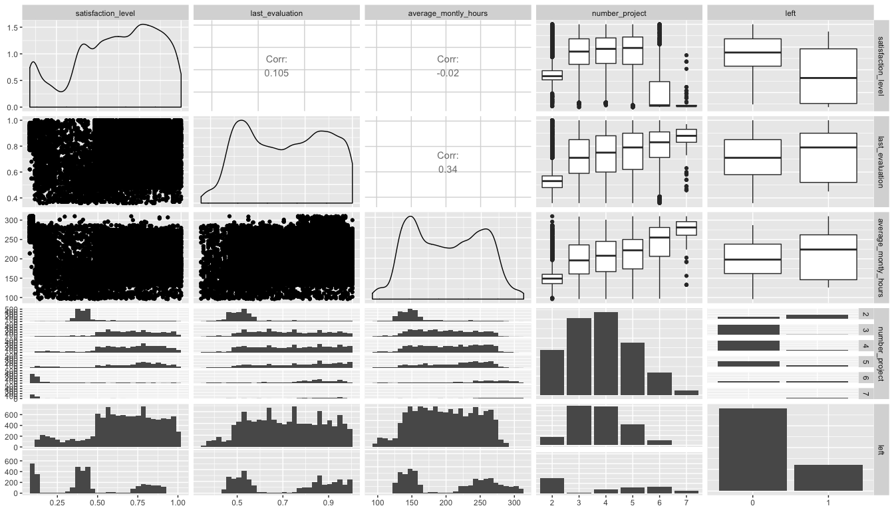
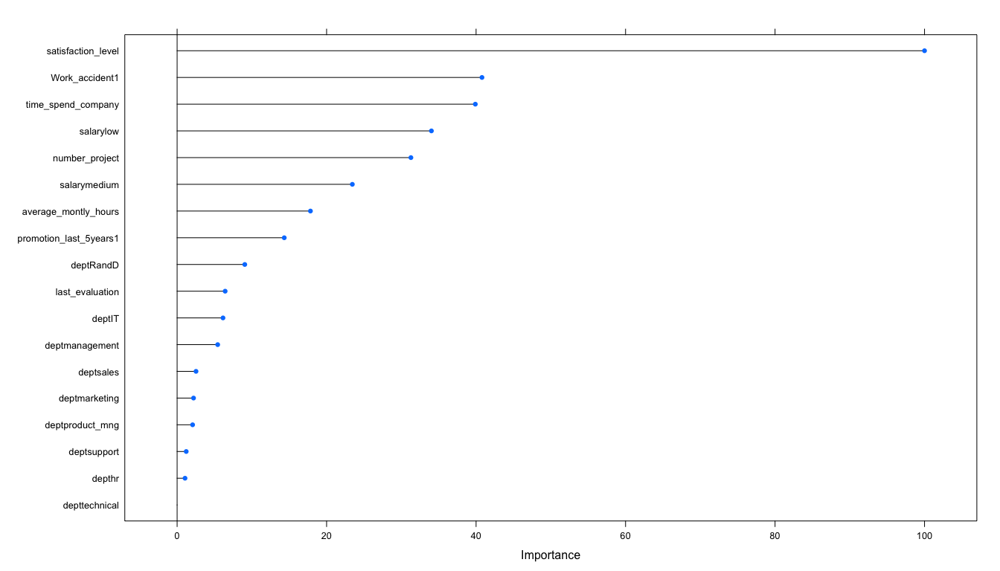

# HR Efficiency Analysis
`r format(Sys.Date())`  


## Problem
###Factors important to retain performing employees
* We will be analysing the data available in hand to identify avenues to improving hr efficiency.
* We will be building a predictive model to determine how long employee would stay and their probability in leaving.

## Data Source
https://www.kaggle.com/ludobenistant/hr-analytics

https://www.kaggle.com/ludobenistant/hr-analytics/downloads/human-resources-analytics.zip

#####Lets load the dataset

```r
hr <- read.csv("./HR_comma_sep.csv", header = TRUE, stringsAsFactors = FALSE)
#hr_corrplot = hr
summary(hr)
```

```
##  satisfaction_level last_evaluation  number_project  average_montly_hours
##  Min.   :0.0900     Min.   :0.3600   Min.   :2.000   Min.   : 96.0       
##  1st Qu.:0.4400     1st Qu.:0.5600   1st Qu.:3.000   1st Qu.:156.0       
##  Median :0.6400     Median :0.7200   Median :4.000   Median :200.0       
##  Mean   :0.6128     Mean   :0.7161   Mean   :3.803   Mean   :201.1       
##  3rd Qu.:0.8200     3rd Qu.:0.8700   3rd Qu.:5.000   3rd Qu.:245.0       
##  Max.   :1.0000     Max.   :1.0000   Max.   :7.000   Max.   :310.0       
##  time_spend_company Work_accident         left       
##  Min.   : 2.000     Min.   :0.0000   Min.   :0.0000  
##  1st Qu.: 3.000     1st Qu.:0.0000   1st Qu.:0.0000  
##  Median : 3.000     Median :0.0000   Median :0.0000  
##  Mean   : 3.498     Mean   :0.1446   Mean   :0.2381  
##  3rd Qu.: 4.000     3rd Qu.:0.0000   3rd Qu.:0.0000  
##  Max.   :10.000     Max.   :1.0000   Max.   :1.0000  
##  promotion_last_5years    sales              salary         
##  Min.   :0.00000       Length:14999       Length:14999      
##  1st Qu.:0.00000       Class :character   Class :character  
##  Median :0.00000       Mode  :character   Mode  :character  
##  Mean   :0.02127                                            
##  3rd Qu.:0.00000                                            
##  Max.   :1.00000
```

* _satisfaction_level_ - Employee Level of satisfaction. It ranges from __0 (low satisfaction)__ to __1 (high satisfaction)__
* _last_evaluation_ - Latest performance evaluation rating of employee. It ranges from __0 (low rating)__ to __1 (high rating)__
* _number_project_ - Number of projects completed while at work. It varies from __2__ to __7__ projects, on an average an employee has worked on __4__ projects.
* _average_montly_hours_ - Average monthly work hours at workplace. It varies from __96 hrs__ to __310 hrs__ with a mean of __201 hrs__ per month.
* _time_spend_company_ - Number of years spent in the company. It ranges from __2__ years to __10__ years, with an average of around __4__ years until now or until they left.
* _Work_accident_ - Whether the employee had a workplace accident
* _left_ - Whether the employee left the workplace or not. __1__ means __left__ and __0__ means still with company. Probability of leaving is __0.23__.
* _promotion_last_5years_ - Whether the employee was promoted in the last five years. __1__ means promoted and __0__ means no promotion in last 5 years. Probability of promotion in last 5 years is __0.02__.


* _sales_ - Department in which they work for. _accounting_, _hr_, _IT_, _management_,  _marketing_, _product_mng_, _RandD_, _sales_, _support_, _technical_ are various departments employees belong to.

```r
summary(as.factor(hr$sales))
```

```
##  accounting          hr          IT  management   marketing product_mng 
##         767         739        1227         630         858         902 
##       RandD       sales     support   technical 
##         787        4140        2229        2720
```

* _salary_ - Salary as high, medium & low.

```r
summary(as.factor(hr$salary))
```

```
##   high    low medium 
##   1237   7316   6446
```

* Fields _number_project_, _promotion_last_5years_, _left_, _Work_accident_, _sales_,_salary_ have discrete values.
* Looking at the summary of the data set there are no bad data , 'blanks', 'NA', null etc.

## Data Wrangling

Rename the _sales_ column to _dept_ and make columns _number_project_, _promotion_last_5years_, _left_, _Work_accident_, _sales_,_salary_ as factor

```r
hr$number_project <- as.factor(hr$number_project)
hr$promotion_last_5years <- as.factor(hr$promotion_last_5years)
hr$left <- as.factor(hr$left)
hr$Work_accident <- as.factor(hr$Work_accident)
hr$sales <- as.factor(hr$sales)
hr$salary <- as.factor(hr$salary)

names(hr)[9] <- "dept"
```

Lets look are structure

```r
  str(hr)
```

```
## 'data.frame':	14999 obs. of  10 variables:
##  $ satisfaction_level   : num  0.38 0.8 0.11 0.72 0.37 0.41 0.1 0.92 0.89 0.42 ...
##  $ last_evaluation      : num  0.53 0.86 0.88 0.87 0.52 0.5 0.77 0.85 1 0.53 ...
##  $ number_project       : Factor w/ 6 levels "2","3","4","5",..: 1 4 6 4 1 1 5 4 4 1 ...
##  $ average_montly_hours : int  157 262 272 223 159 153 247 259 224 142 ...
##  $ time_spend_company   : int  3 6 4 5 3 3 4 5 5 3 ...
##  $ Work_accident        : Factor w/ 2 levels "0","1": 1 1 1 1 1 1 1 1 1 1 ...
##  $ left                 : Factor w/ 2 levels "0","1": 2 2 2 2 2 2 2 2 2 2 ...
##  $ promotion_last_5years: Factor w/ 2 levels "0","1": 1 1 1 1 1 1 1 1 1 1 ...
##  $ dept                 : Factor w/ 10 levels "accounting","hr",..: 8 8 8 8 8 8 8 8 8 8 ...
##  $ salary               : Factor w/ 3 levels "high","low","medium": 2 3 3 2 2 2 2 2 2 2 ...
```

## Data Exploration

Lets look at correaltion between these various columns


```r
corr_plot_data <- hr %>%  dplyr::select(satisfaction_level,last_evaluation,average_montly_hours,number_project,time_spend_company,left)

corr_plot_data$number_project <- as.numeric(corr_plot_data$number_project)
corr_plot_data$left <- as.numeric(corr_plot_data$left)
corrplot(corr_plot_data, color = TRUE)
```

<!-- -->

* There is strong correlation between _last_evaluation_, _number_project_, _average_monthly_hours_.
* There is also strong correlation between _satisfaction_level_ & _left_.


```r
#Work_accident vs left
conf_matrix <- confusionMatrix(hr$left,hr$Work_accident , dnn = c("Left","Work_accident"), mode = "sens_spec")
conf_matrix$table
```

```
##     Work_accident
## Left    0    1
##    0 9428 2000
##    1 3402  169
```
* Specificity is low - Proportion of folks leaving due to accident is lower 0.0779161
* Sensitivity is high - Indicates large proportion of accident continue to stay 0.7348402
* Overall Work_accident is not top reason for leaving


```r
#dept vs left
attrition_matrix <- data.frame(table(hr$left, hr$dept) ) %>% tidyr::spread(Var1, Freq)
names(attrition_matrix)[1] <- "dept"
names(attrition_matrix)[2] <- "Emp_Remain"
names(attrition_matrix)[3] <- "Emp_Left"

attrition_matrix <- attrition_matrix %>% mutate(rate = Emp_Left/Emp_Remain )

#attrition by dept
attrition_matrix %>% arrange(desc(rate))
```

```
##           dept Emp_Remain Emp_Left      rate
## 1           hr        524      215 0.4103053
## 2   accounting        563      204 0.3623446
## 3    technical       2023      697 0.3445378
## 4      support       1674      555 0.3315412
## 5        sales       3126     1014 0.3243762
## 6    marketing        655      203 0.3099237
## 7           IT        954      273 0.2861635
## 8  product_mng        704      198 0.2812500
## 9        RandD        666      121 0.1816817
## 10  management        539       91 0.1688312
```
* hr dept with 0.41 has highest attrition and management dept at 0.16 has least attrition


```r
#salary vs left
attrition_matrix <- data.frame(table(hr$left, hr$salary) ) %>% tidyr::spread(Var1, Freq)
names(attrition_matrix)[1] <- "Salary"
names(attrition_matrix)[2] <- "Emp_Remain"
names(attrition_matrix)[3] <- "Emp_Left"

attrition_matrix <- attrition_matrix %>% mutate(rate = Emp_Left/Emp_Remain )

#attrition by salary level
attrition_matrix %>% arrange(desc(rate))
```

```
##   Salary Emp_Remain Emp_Left       rate
## 1    low       5144     2172 0.42223950
## 2 medium       5129     1317 0.25677520
## 3   high       1155       82 0.07099567
```
* Emplyees with low salary has the highest attrition and attrition tapers for employees in medium and high salary brackets.


```r
#promotion_last_5years vs left
conf_matrix <- confusionMatrix(hr$left,hr$promotion_last_5years, dnn= c("Left","promotion_last_5years"), mode = "sens_spec")
conf_matrix$table
```

```
##     promotion_last_5years
## Left     0     1
##    0 11128   300
##    1  3552    19
```

* Specificity is low - Proportion of folks leaving is low among folks with promotion 0.0595611

* Sensitivity is high - Indicates high percent of employees who did not get promoted yet continued to stay 0.7580381
* Overall promotion_last_5years is not top reason for leaving 

Lets analyze _satisfaction_level_, _time_spend_company_, _last_evaluation_, _average_monthly_hours_, _work_accident_, _salary_ and _number_project_


```r
satis_l <- hr %>% ggplot(aes(satisfaction_level)) +
  geom_histogram( binwidth = 0.05, aes(fill = left)) +
  labs(x = "satisfaction_level", y = "employees", title = "satisfaction level") + myTheme

lst_eval <- hr %>% ggplot(aes(last_evaluation)) +
  geom_histogram( binwidth = 0.05, aes(fill = left)) +
  labs(x = "last_evaluation", y = "employees", title = "Last evaluation") + myTheme

tm_spnd <- hr %>% ggplot(aes(time_spend_company)) +
  geom_histogram( binwidth = 1, aes(fill = left)) +
  labs(x = "time_spend_company", y = "employees", title = "Time Spend in Company") + myTheme


mnthly_hrs <- hr %>% ggplot(aes(average_montly_hours)) +
  geom_histogram( binwidth = 1, aes(fill = left)) +
  labs(x = "average_montly_hours", y = "employees", title = "Average montly hours") + myTheme

wrk_accdnt <- hr %>% ggplot(aes(Work_accident)) +
  geom_histogram( binwidth = 0.05, aes(fill = left), stat = "count") +
  labs(x = "Work_accident", y = "employees", title = "Work accident") + myTheme

sal <- hr %>% ggplot(aes(salary)) +
  geom_histogram( binwidth = 0.05, aes(fill = left), stat = "count") +
  labs(x = "salary", y = "employees", title = "Salary") + myTheme

nmbr_prj <- hr %>% ggplot(aes(as.numeric(number_project))) +
  geom_histogram( binwidth = 1, aes(fill = left)) +
  labs(x = "number_project", y = "employees", title = "Number of projects") + myTheme

grid.arrange(satis_l, lst_eval, sal, tm_spnd, mnthly_hrs,nmbr_prj, wrk_accdnt, nrow = 3)
```

<!-- -->

* Overall lower performing employees are leaving more. This warrants improvement in hiring process to avoid low performers
* Aside from low performers, we can notice number of employees leaving creeeping up among mid to high performing. This is an area that needs to be also looked into for reduction in rate of attrition.  
* Retention is higher for employees who have
  + been with the company for 4 or less (3rd quartile)
  + Average monthly hours of 245 hrs or less
  + No work accident


###Cluster Analysis

```r
#lets identify optimum number of clusters
wssplot <- function(data, nc = 15, seed = 1234) {
  wss <- (nrow(data) - 1) * sum(apply(data, 2, var))
  for (i in 2:nc) {
    set.seed(seed)
    wss[i] <- sum(kmeans(data, centers = i)$withinss)
  }
  plot(1:nc,
       wss,
       type = "b",
       xlab = "Number of Clusters",
       ylab = "Within groups sum of squares")   
}

#lets make all fields numeric
hr_clust <- hr
hr_clust$dept <- as.numeric( as.factor(hr_clust$dept))
hr_clust$salary <- as.numeric( as.factor(hr_clust$salary))
hr_clust$number_project <- as.numeric( hr_clust$number_project)
hr_clust$Work_accident <- as.numeric( hr_clust$Work_accident)
hr_clust$left <- as.numeric(hr_clust$left)
hr_clust$promotion_last_5years <- as.numeric(hr_clust$promotion_last_5years)

wssplot(scale(hr_clust))
```

<!-- -->


```r
# lets consider 9 clusters 

fit.km <- kmeans(scale(hr_clust), 9)
clusplot(hr_clust,fit.km$cluster)
```

<!-- -->


```r
# lets analyze 9 clusters 
corrplot_cluster <- function(data, nc = 15) {
  for (i in 1:nc) {
  corrplot(data %>% filter(`fit.km$cluster` == i), color = TRUE)
  }
}
corrplot_cluster(cbind(hr_clust, fit.km$cluster),nc = 9)
```

<!-- --><!-- --><!-- --><!-- --><!-- --><!-- --><!-- --><!-- --><!-- -->


##Regression Model

###Linear Regression
Lets build a model to determine how long an employee will stay


####Train Data

```r
set.seed(3456)
trainIndex <- createDataPartition(hr$time_spend_company, p = .8, 
                                  list = FALSE, 
                                  times = 1)
head(trainIndex)
```

```
##      Resample1
## [1,]         1
## [2,]         2
## [3,]         3
## [4,]         4
## [5,]         6
## [6,]         7
```

```r
hrTrain <- hr[ trainIndex,]
```
###Test Data

```r
hrTest  <- hr[-trainIndex,]
```

###Models
####Lets use caret package to anlyze significant fields for linear model

```r
plot(varImp(train(time_spend_company ~ ., data = hrTrain, method = "lm")))
```

<!-- -->


```r
lm_time_spend <- lm(time_spend_company~left+ dept+ promotion_last_5years + number_project+last_evaluation+salary+Work_accident+satisfaction_level, data = hrTrain)
lm_time_spend_summary <- summary(lm_time_spend)
lm_time_spend_summary
```

```
## 
## Call:
## lm(formula = time_spend_company ~ left + dept + promotion_last_5years + 
##     number_project + last_evaluation + salary + Work_accident + 
##     satisfaction_level, data = hrTrain)
## 
## Residuals:
##     Min      1Q  Median      3Q     Max 
## -3.0400 -0.7504 -0.3007  0.5320  7.3900 
## 
## Coefficients:
##                        Estimate Std. Error t value Pr(>|t|)    
## (Intercept)             2.77912    0.09433  29.462  < 2e-16 ***
## left1                   0.63893    0.03876  16.486  < 2e-16 ***
## depthr                 -0.13112    0.08079  -1.623  0.10462    
## deptIT                 -0.01996    0.07184  -0.278  0.78109    
## deptmanagement          0.76761    0.08592   8.934  < 2e-16 ***
## deptmarketing           0.06117    0.07744   0.790  0.42961    
## deptproduct_mng        -0.01471    0.07673  -0.192  0.84793    
## deptRandD              -0.09905    0.07934  -1.248  0.21193    
## deptsales               0.05646    0.06155   0.917  0.35905    
## deptsupport            -0.10529    0.06536  -1.611  0.10721    
## depttechnical          -0.10663    0.06394  -1.668  0.09538 .  
## promotion_last_5years1  0.66069    0.08732   7.566 4.12e-14 ***
## number_project3         0.44959    0.04950   9.083  < 2e-16 ***
## number_project4         0.57525    0.04861  11.833  < 2e-16 ***
## number_project5         0.81733    0.05003  16.337  < 2e-16 ***
## number_project6         0.90317    0.06061  14.900  < 2e-16 ***
## number_project7         0.43963    0.10828   4.060 4.93e-05 ***
## last_evaluation         0.58316    0.08245   7.073 1.60e-12 ***
## salarylow              -0.25741    0.04942  -5.208 1.94e-07 ***
## salarymedium           -0.15532    0.04939  -3.145  0.00166 ** 
## Work_accident1          0.10552    0.03646   2.894  0.00381 ** 
## satisfaction_level     -0.33098    0.06315  -5.242 1.62e-07 ***
## ---
## Signif. codes:  0 '***' 0.001 '**' 0.01 '*' 0.05 '.' 0.1 ' ' 1
## 
## Residual standard error: 1.389 on 11978 degrees of freedom
## Multiple R-squared:  0.09614,	Adjusted R-squared:  0.09456 
## F-statistic: 60.67 on 21 and 11978 DF,  p-value: < 2.2e-16
```


```r
lm_time_spend_mthly_hrs <- lm(time_spend_company~left+ dept+ promotion_last_5years + number_project+last_evaluation+average_montly_hours+salary+Work_accident+satisfaction_level, data = hrTrain)
lm_time_spend_mthly_hrs_summary <- summary(lm_time_spend_mthly_hrs)
lm_time_spend_mthly_hrs_summary
```

```
## 
## Call:
## lm(formula = time_spend_company ~ left + dept + promotion_last_5years + 
##     number_project + last_evaluation + average_montly_hours + 
##     salary + Work_accident + satisfaction_level, data = hrTrain)
## 
## Residuals:
##     Min      1Q  Median      3Q     Max 
## -3.0786 -0.7528 -0.2949  0.5295  7.4144 
## 
## Coefficients:
##                          Estimate Std. Error t value Pr(>|t|)    
## (Intercept)             2.6867716  0.1002150  26.810  < 2e-16 ***
## left1                   0.6249161  0.0390866  15.988  < 2e-16 ***
## depthr                 -0.1293365  0.0807707  -1.601  0.10934    
## deptIT                 -0.0212317  0.0718190  -0.296  0.76752    
## deptmanagement          0.7671733  0.0858984   8.931  < 2e-16 ***
## deptmarketing           0.0613582  0.0774212   0.793  0.42807    
## deptproduct_mng        -0.0135680  0.0767115  -0.177  0.85961    
## deptRandD              -0.0982576  0.0793240  -1.239  0.21549    
## deptsales               0.0559841  0.0615346   0.910  0.36295    
## deptsupport            -0.1046692  0.0653385  -1.602  0.10919    
## depttechnical          -0.1066023  0.0639189  -1.668  0.09539 .  
## promotion_last_5years1  0.6591716  0.0872989   7.551 4.64e-14 ***
## number_project3         0.4194255  0.0507082   8.271  < 2e-16 ***
## number_project4         0.5411451  0.0501890  10.782  < 2e-16 ***
## number_project5         0.7804544  0.0518179  15.061  < 2e-16 ***
## number_project6         0.8480698  0.0638870  13.275  < 2e-16 ***
## number_project7         0.3636052  0.1117920   3.253  0.00115 ** 
## last_evaluation         0.5414941  0.0838334   6.459 1.09e-10 ***
## average_montly_hours    0.0007928  0.0002911   2.723  0.00647 ** 
## salarylow              -0.2558201  0.0494136  -5.177 2.29e-07 ***
## salarymedium           -0.1540695  0.0493761  -3.120  0.00181 ** 
## Work_accident1          0.1047198  0.0364529   2.873  0.00408 ** 
## satisfaction_level     -0.3380187  0.0631810  -5.350 8.96e-08 ***
## ---
## Signif. codes:  0 '***' 0.001 '**' 0.01 '*' 0.05 '.' 0.1 ' ' 1
## 
## Residual standard error: 1.389 on 11977 degrees of freedom
## Multiple R-squared:  0.0967,	Adjusted R-squared:  0.09504 
## F-statistic: 58.28 on 22 and 11977 DF,  p-value: < 2.2e-16
```

###Lets compare the two models

```r
lm_model_anova <- anova(lm_time_spend,lm_time_spend_mthly_hrs)
lm_model_anova
```

```
## Analysis of Variance Table
## 
## Model 1: time_spend_company ~ left + dept + promotion_last_5years + number_project + 
##     last_evaluation + salary + Work_accident + satisfaction_level
## Model 2: time_spend_company ~ left + dept + promotion_last_5years + number_project + 
##     last_evaluation + average_montly_hours + salary + Work_accident + 
##     satisfaction_level
##   Res.Df   RSS Df Sum of Sq      F   Pr(>F)   
## 1  11978 23117                                
## 2  11977 23103  1    14.306 7.4165 0.006472 **
## ---
## Signif. codes:  0 '***' 0.001 '**' 0.01 '*' 0.05 '.' 0.1 ' ' 1
```

_lm_time_spend_ has an R Squared of 0.0961402 and adjusted R-Squared of 0.0945555

_lm_time_spend_mthly_hrs_ has an R Squared of 0.0966995 and adjusted R-Squared of 0.0950403


#####Based on anova and both R Squared and Adjusted R Squared model _lm_time_spend_mthly_hrs_ seems to be a better fit. However R-Squared is very low and close to 0, model is a poor fit.


###Predict using the model _lm_time_spend_mthly_hrs_

```r
predict_lm_emp_leaving <- predict(lm_time_spend_mthly_hrs, newdata = hrTest)
#summary of prediction
summary(predict_lm_emp_leaving)
```

```
##    Min. 1st Qu.  Median    Mean 3rd Qu.    Max. 
##   2.412   3.227   3.390   3.515   3.703   5.460
```

```r
#summary of actuals
summary(hrTest$time_spend_company)
```

```
##    Min. 1st Qu.  Median    Mean 3rd Qu.    Max. 
##   2.000   3.000   3.000   3.491   4.000  10.000
```


```r
#Create data frame actual vs predicted
p <- data.frame(predict_lm_emp_leaving)
p$ID <- as.numeric(rownames(p))
p$Type <- 'Predicted'
names(p)[1] <- 'time_spend_company'

a <- data.frame(hrTest$time_spend_company)
a$ID <- as.numeric(rownames(hrTest))
a$Type <- 'Actual'
names(a)[1] <- 'time_spend_company'

m <- data.frame(rbind(a,p))
```


```r
#plot predict and actual
m %>% ggplot(aes(x = ID, y = time_spend_company, col = Type)) + 
  geom_line() + 
  geom_smooth() +
  labs(x = "Observation", y = "Number of years spent in the company", title = "Plot Predicted & Actual Time spend vs Observation") +
  scale_colour_brewer(palette = brewer.pal(11,"Spectral")) +
  myTheme
```

<!-- -->


```r
#correlation data
plot_data <- data.frame(predict_lm_emp_leaving, hrTest$time_spend_company)
names(plot_data)[1] <- "predicted"
names(plot_data)[2] <- "actual"

plot_data$predicted <- round(plot_data$predicted)

correlation <- cor(plot_data)
correlation
```

```
##           predicted    actual
## predicted 1.0000000 0.2653889
## actual    0.2653889 1.0000000
```

```r
#correlation
correlation[1,2]
```

```
## [1] 0.2653889
```

The correlation coefficient is low __0.2653889__


```r
#lets see how good the model prediction was

#Sum of squared errors(SSE)
sse = sum((hrTest$time_spend_company - predict_lm_emp_leaving ) ^ 2)
round(sse, digits = 2)
```

```
## [1] 5886.96
```

```r
#Root mean squared errors (RMSE)
rmse = sqrt(sse / nrow(hrTest))
round(rmse, digits = 2)
```

```
## [1] 1.4
```
####_lm_time_spend_mthly_hrs_ prediction has an 'Root mean squared errors' 1.4 and correlation coefficient of 0.27

###Logistic Regression
Lets build a model to predict if the employee will leave

####Train Data

```r
set.seed(3456)
trainIndex <- createDataPartition(hr$left, p = .8, 
                                  list = FALSE, 
                                  times = 1)
head(trainIndex)
```

```
##      Resample1
## [1,]         1
## [2,]         2
## [3,]         3
## [4,]         4
## [5,]         5
## [6,]         6
```

```r
hrTrain <- hr[ trainIndex,]
```
###Test Data

```r
hrTest  <- hr[-trainIndex,]
```

###Models

#####Significant fields


```r
plot(varImp(train(left ~ ., data = hrTrain, method = "bayesglm")))
```

<!-- -->

#####Significant fields
* _satisfaction_level_, _Work_accident_, _salary_, _time_spend_company_, _number_project_, _average_montly_hours_, _promotion_last_5years_, _dept_


```r
fitControl <- trainControl(method = "bayesglm",
                           number = 10,repeats = 10)
log_model <- train(left ~ satisfaction_level + Work_accident  + salary + time_spend_company + number_project + average_montly_hours + promotion_last_5years + dept, data = hrTrain, method = "bayesglm" )

summary(log_model)
```

```
## 
## Call:
## NULL
## 
## Deviance Residuals: 
##     Min       1Q   Median       3Q      Max  
## -2.9440  -0.4501  -0.1985  -0.0488   3.3761  
## 
## Coefficients:
##                          Estimate Std. Error z value Pr(>|z|)    
## (Intercept)            -2.6828342  0.2401230 -11.173  < 2e-16 ***
## satisfaction_level     -1.7539349  0.1355339 -12.941  < 2e-16 ***
## Work_accident1         -1.5383925  0.1115533 -13.791  < 2e-16 ***
## salarylow               2.0035527  0.1562474  12.823  < 2e-16 ***
## salarymedium            1.4026695  0.1572798   8.918  < 2e-16 ***
## time_spend_company      0.3862053  0.0208829  18.494  < 2e-16 ***
## number_project3        -5.1284886  0.1542371 -33.251  < 2e-16 ***
## number_project4        -3.4627180  0.0976779 -35.450  < 2e-16 ***
## number_project5        -2.4907441  0.0949466 -26.233  < 2e-16 ***
## number_project6        -1.9716310  0.1173970 -16.795  < 2e-16 ***
## number_project7         3.6884820  1.5495571   2.380 0.017296 *  
## average_montly_hours    0.0104773  0.0007006  14.956  < 2e-16 ***
## promotion_last_5years1 -1.5184458  0.3130866  -4.850 1.24e-06 ***
## depthr                  0.2233547  0.1750196   1.276 0.201896    
## deptIT                 -0.3576959  0.1586627  -2.254 0.024168 *  
## deptmanagement         -0.6965299  0.2113314  -3.296 0.000981 ***
## deptmarketing          -0.0962021  0.1736328  -0.554 0.579541    
## deptproduct_mng        -0.3870671  0.1700673  -2.276 0.022848 *  
## deptRandD              -0.7334726  0.1911180  -3.838 0.000124 ***
## deptsales              -0.2587630  0.1336867  -1.936 0.052918 .  
## deptsupport            -0.0595977  0.1427255  -0.418 0.676262    
## depttechnical          -0.0698578  0.1388474  -0.503 0.614875    
## ---
## Signif. codes:  0 '***' 0.001 '**' 0.01 '*' 0.05 '.' 0.1 ' ' 1
## 
## (Dispersion parameter for binomial family taken to be 1)
## 
##     Null deviance: 13172.7  on 11999  degrees of freedom
## Residual deviance:  7490.5  on 11978  degrees of freedom
## AIC: 7534.5
## 
## Number of Fisher Scoring iterations: 16
```


```r
#Lets test prediction using test data 
testPredication <- predict(log_model,hrTest)
confusionMatrix(testPredication,hrTest$left, dnn = c("Predicted","actual"), mode = "sens_spec")
```

```
## Confusion Matrix and Statistics
## 
##          actual
## Predicted    0    1
##         0 2098  227
##         1  187  487
##                                           
##                Accuracy : 0.862           
##                  95% CI : (0.8491, 0.8741)
##     No Information Rate : 0.7619          
##     P-Value [Acc > NIR] : < 2e-16         
##                                           
##                   Kappa : 0.612           
##  Mcnemar's Test P-Value : 0.05527         
##                                           
##             Sensitivity : 0.9182          
##             Specificity : 0.6821          
##          Pos Pred Value : 0.9024          
##          Neg Pred Value : 0.7226          
##              Prevalence : 0.7619          
##          Detection Rate : 0.6996          
##    Detection Prevalence : 0.7753          
##       Balanced Accuracy : 0.8001          
##                                           
##        'Positive' Class : 0               
## 
```

```r
defaultSummary(data.frame(obs = hrTest$left, pred = testPredication))
```

```
##  Accuracy     Kappa 
## 0.8619540 0.6120213
```


```r
library(doMC)
registerDoMC(5)
hrTrain_1 <- hrTrain [createDataPartition(y=hrTrain$left,p=0.3,list=FALSE),]
rf_model<-train(left~.,data=hrTrain_1,method="rf",
                trControl=trainControl(method="cv",number=5),
                prox=TRUE,allowParallel=TRUE)
print(rf_model)
```

```
## Random Forest 
## 
## 3601 samples
##    9 predictor
##    2 classes: '0', '1' 
## 
## No pre-processing
## Resampling: Cross-Validated (5 fold) 
## Summary of sample sizes: 2880, 2881, 2880, 2881, 2882 
## Resampling results across tuning parameters:
## 
##   mtry  Accuracy   Kappa    
##    2    0.9461315  0.8400073
##   12    0.9805644  0.9452727
##   22    0.9791759  0.9416091
## 
## Accuracy was used to select the optimal model using  the largest value.
## The final value used for the model was mtry = 12.
```

