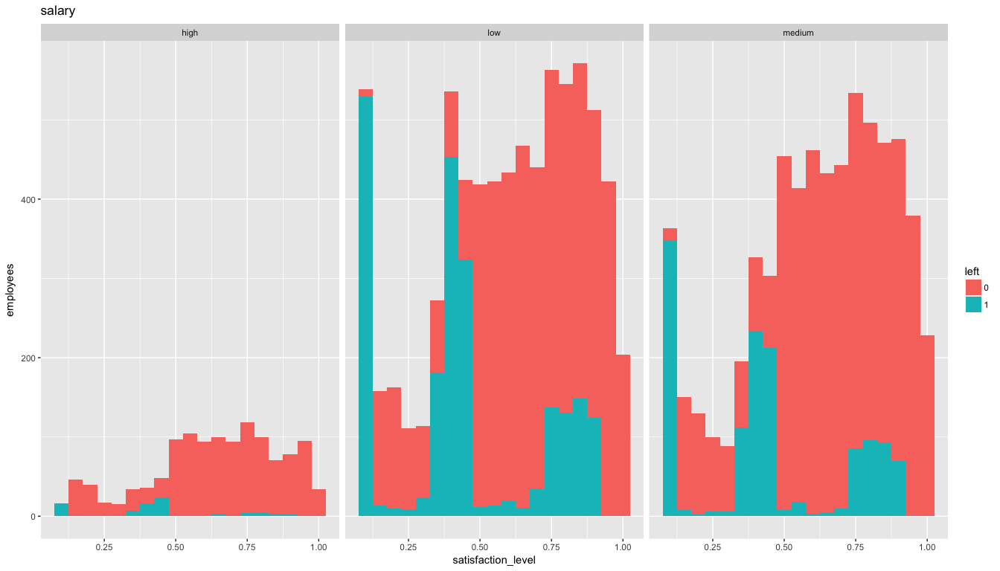
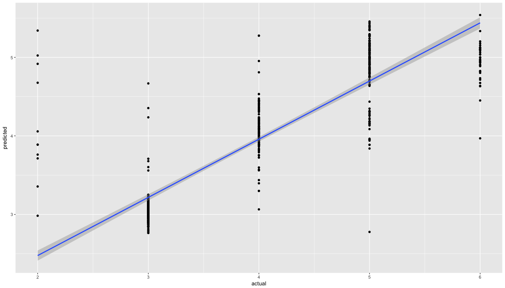

# HR Efficiency Analysis
`r format(Sys.Date())`  


## Problem
###Factors important to retain performing employees
* We will be analysing the data available in hand to identify avenues to improving hr efficiency.
* We will be building a predictive model to determine how long employee would stay and their probability in leaving.

## Data Source
https://www.kaggle.com/ludobenistant/hr-analytics

https://www.kaggle.com/ludobenistant/hr-analytics/downloads/human-resources-analytics.zip

#####Lets load the dataset

```r
hr <- read.csv("./HR_comma_sep.csv", 
               header = TRUE, 
               stringsAsFactors = FALSE)

summary(hr)
```

```
##  satisfaction_level last_evaluation  number_project  average_montly_hours
##  Min.   :0.0900     Min.   :0.3600   Min.   :2.000   Min.   : 96.0       
##  1st Qu.:0.4400     1st Qu.:0.5600   1st Qu.:3.000   1st Qu.:156.0       
##  Median :0.6400     Median :0.7200   Median :4.000   Median :200.0       
##  Mean   :0.6128     Mean   :0.7161   Mean   :3.803   Mean   :201.1       
##  3rd Qu.:0.8200     3rd Qu.:0.8700   3rd Qu.:5.000   3rd Qu.:245.0       
##  Max.   :1.0000     Max.   :1.0000   Max.   :7.000   Max.   :310.0       
##  time_spend_company Work_accident         left       
##  Min.   : 2.000     Min.   :0.0000   Min.   :0.0000  
##  1st Qu.: 3.000     1st Qu.:0.0000   1st Qu.:0.0000  
##  Median : 3.000     Median :0.0000   Median :0.0000  
##  Mean   : 3.498     Mean   :0.1446   Mean   :0.2381  
##  3rd Qu.: 4.000     3rd Qu.:0.0000   3rd Qu.:0.0000  
##  Max.   :10.000     Max.   :1.0000   Max.   :1.0000  
##  promotion_last_5years    sales              salary         
##  Min.   :0.00000       Length:14999       Length:14999      
##  1st Qu.:0.00000       Class :character   Class :character  
##  Median :0.00000       Mode  :character   Mode  :character  
##  Mean   :0.02127                                            
##  3rd Qu.:0.00000                                            
##  Max.   :1.00000
```

* _satisfaction_level_ - Employee Level of satisfaction. It ranges from __0 (low satisfaction)__ to __1 (high satisfaction)__
* _last_evaluation_ - Latest performance evaluation rating of employee. It ranges from __0 (low rating)__ to __1 (high rating)__
* _number_project_ - Number of projects completed while at work. It varies from __2__ to __7__ projects, on an average an employee has worked on __4__ projects.
* _average_montly_hours_ - Average monthly work hours at workplace. It varies from __96 hrs__ to __310 hrs__ with a mean of __201 hrs__ per month.
* _time_spend_company_ - Number of years spent in the company. It ranges from __2__ years to __10__ years, with an average of around __4__ years until now or until they left.
* _Work_accident_ - Whether the employee had a workplace accident
* _left_ - Whether the employee left the workplace or not. __1__ means __left__ and __0__ means still with company. Probability of leaving is __0.23__.
* _promotion_last_5years_ - Whether the employee was promoted in the last five years. __1__ means promoted and __0__ means no promotion in last 5 years. Probability of promotion in last 5 years is __0.02__.


* _sales_ - Department in which they work for. _accounting_, _hr_, _IT_, _management_,  _marketing_, _product_mng_, _RandD_, _sales_, _support_, _technical_ are various departments employees belong to.

```r
summary(as.factor(hr$sales))
```

```
##  accounting          hr          IT  management   marketing product_mng 
##         767         739        1227         630         858         902 
##       RandD       sales     support   technical 
##         787        4140        2229        2720
```

* _salary_ - Salary as high, medium & low.

```r
summary(as.factor(hr$salary))
```

```
##   high    low medium 
##   1237   7316   6446
```

* Fields _number_project_, _promotion_last_5years_, _left_, _Work_accident_, _sales_,_salary_ have discrete values.
* Looking at the summary of the data set there are no bad data , 'blanks', 'NA', null etc.

## Data Wrangling

Rename the _sales_ column to _dept_ and make columns _number_project_, _promotion_last_5years_, _left_, _Work_accident_, _sales_,_salary_ as factor

```r
#hr$number_project <- as.factor(hr$number_project)
hr$promotion_last_5years <- as.factor(hr$promotion_last_5years)
hr$left <- as.factor(hr$left)
hr$Work_accident <- as.factor(hr$Work_accident)
hr$sales <- as.factor(hr$sales)
hr$salary <- as.factor(hr$salary)

names(hr)[9] <- "dept"
```

Lets look are structure

```r
  str(hr)
```

```
## 'data.frame':	14999 obs. of  10 variables:
##  $ satisfaction_level   : num  0.38 0.8 0.11 0.72 0.37 0.41 0.1 0.92 0.89 0.42 ...
##  $ last_evaluation      : num  0.53 0.86 0.88 0.87 0.52 0.5 0.77 0.85 1 0.53 ...
##  $ number_project       : int  2 5 7 5 2 2 6 5 5 2 ...
##  $ average_montly_hours : int  157 262 272 223 159 153 247 259 224 142 ...
##  $ time_spend_company   : int  3 6 4 5 3 3 4 5 5 3 ...
##  $ Work_accident        : Factor w/ 2 levels "0","1": 1 1 1 1 1 1 1 1 1 1 ...
##  $ left                 : Factor w/ 2 levels "0","1": 2 2 2 2 2 2 2 2 2 2 ...
##  $ promotion_last_5years: Factor w/ 2 levels "0","1": 1 1 1 1 1 1 1 1 1 1 ...
##  $ dept                 : Factor w/ 10 levels "accounting","hr",..: 8 8 8 8 8 8 8 8 8 8 ...
##  $ salary               : Factor w/ 3 levels "high","low","medium": 2 3 3 2 2 2 2 2 2 2 ...
```

## Data Exploration

###Exploratory analysis with ggpairs

Lets look at correlation between these various columns


```r
hr_correl <- hr
hr_correl$number_project <- as.factor(hr_correl$number_project)
hr_correl$time_spend_company <- as.factor(hr_correl$time_spend_company)
hr_correl %>%  dplyr::select(
  satisfaction_level,
  last_evaluation,
  average_montly_hours,
  number_project,
  time_spend_company,
  left
  ) %>% ggpairs() 
```

<!-- -->

####number_project (Number of projects)
* employees involved in 3-5 projects have high satisfaction level, less than 3 projects or more than 5 projects satisfaction is low
* last_evaluation increases with number_project
* average_monthly_hours also increases with number_project
* number of employees leaving (left=1) is high at 2 or less improves for 3 projects and then slowly creeps up until 5 projects and goes down
* Overall Looks like 3-5 projects would mean less employees quiting and good employee satisfaction.

####average_monthly_hours (Average monthly hours)
* relation to satisfaction or last_evaluation is not very obvious
* average_monthly_hours seems to increase with number_project
* employees leaving (left=1)
  + 150 hours +/- 25 shows high number of employees leaving
	+ Again 225 hours and more employees leaving creaps to peak at around 250 hours and dips gradually to 300 hours
	+ 175 hours - 225 hours for average_monthly_hours seems to have low rate of employees leaving

####last_evaluation (Latest evaluation rating for the employee, ranges 0=low to 1=high)
* Between 0.4 to 0.6 evaluation rating, employees leaving (left=1) is high.
* It goes down at mid level and then picks up at around 0.75 and peaks around 0.85
* So low and higher end of evaluation rating employees leaving is high.
* Though one's leaving at lower rating is good for the company but the employees leaving having high rating is a concern for the company. 	
	
####satisfaction_level (Measure of employee statisfaction level, ranges 0=low to 1=high)
* number projects between 3-5 show high satisfaction, less projects or too many projects tend to lower satisfaction
* employees leaving have lower satisfaction than employees not leaving the company

####time_spend_company
* Employees who have been with the company 4-6 years seems to be having evaluation rating higher as well as higher average monthly hours.
* Employees who have been with comapny for 3 years shows higher rate of leaving company
* with respect to satisfaction level, intial years its high and its dips by 4 years and then picks up and stabilizes.
* Between 3 - 4 years period we see satisfaction level dipping and a peak in employees leaving. This is an area to be looked into.  

####overall
Looks like employees involved in 3 -5 projects and putting in 175 hours - 225 hours average monthly hours have lower rate of leaving company and have high satisfaction level.
Assuming 22 working days a month, 175 hours - 225 hours average monthly hours translates to 8 - 10 hrs per day.


```r
hr %>%  dplyr::select(Work_accident, promotion_last_5years, salary, left) %>% ggpairs()
```

<!-- -->

####Work_accident ( Accidents during work - 1 indicates accident )
* A small percent of employees involved in Work_accident are actually leaving company. Work_accident does not seem very significant.
* Work_accident is higher at medium and lower salary level than in higher salary level

####promotion_last_5years (Promotion in last 5 years - 1 indicates promotion)
* Very few employees are getting promoted
* number of employees getting promoted are even at different salary level.

####salary ( Salary category for employees as high, medium and low)
* Higher number of employees leaving are in the medium & low salary level

####overall
Work_accident, promotion_last_5years & salary seems to have lower impact on employees leaving company.


###Exploratory Analysis using ggplots , geom_histogram & facet_grids
Lets plot satisfaction_level against facets number_project, average_montly_hours, time_spend_company, promotion_last_5years, Work_accident, salary & dept. Each plot correlates satisfaction_level(histogram), left (fill ) with one of the other atribute as facets. 

#### number_project

```r
hr_explore <- hr

hr_explore %>% ggplot(aes(satisfaction_level)) + 
  geom_histogram(binwidth = 0.05, aes(fill = left)) + labs(x = "satisfaction_level", y = "employees", title = "number_project") + 
  facet_grid(. ~ number_project) + 
  myTheme
```

<!-- -->
  
  * Most of employees having 2 projects are showing a high rate of leaving most of them seem to be mid level satisfaction_level. 
  * Most of the employees having 3 - 5 projects are having high satisfaction level. We can also see employees leaving creeping between 3 - 5 projects and most of employees leaving are having high satisfaction level too.
  * 6 - 7 projects however we see satisfaction level being very low and a very high rate employees leaving.

####average_montly_hours

```r
hr_explore$monthly_hrs_range <- cut(hr_explore$average_montly_hours,
                                    breaks = c(0, 174, 225, 250, 275, 300, 325, 350),
                                    labels = c("174", "225", "250", "275", "300", "325", "350"),
                                    right = FALSE
                                    )
hr_explore %>% ggplot(aes(satisfaction_level)) + 
  geom_histogram(binwidth = 0.05, aes(fill = left)) + labs(x = "satisfaction_level", y = "employees", title = "monthly_hrs_range") + 
  facet_grid(. ~monthly_hrs_range) + 
  myTheme
```

<!-- -->
  
  * Since average_montly_hours is continous data, in order for being able to use as a facet lets make it a discrete by creating ranges / monthly_hrs_range. Starting at 174 hours as that is __normal__ average monthly hours.
  * Employees putting in 174 and less average monthly hours show medium satisfaction and very high rate of leaving.
  * Employees putting in 174 - 275 average monthly hours show mostly higher satisfaction level and we can see rate of leaving in high satisfaction level creeping.
  * Employees putting in 275 hours and more average monthly hours are having a very low satisfaction level and are mostly leaving.

#### last_evaluation

```r
hr_explore$evaluation_range <- as.factor(round(hr_explore$last_evaluation,1))

hr_explore %>% ggplot(aes(satisfaction_level)) + 
  geom_histogram(binwidth = 0.05, aes(fill = left)) + labs(x = "satisfaction_level", y = "employees", title = "evaluation_range") + 
  facet_grid(. ~ evaluation_range) + 
  myTheme
```

<!-- -->

* Since last_evaluation is continous data, first lets round the last evaluation to 1 place and then make it into a factor
* Employees having evaluation rating 0.4 - 0.6, show satisafaction levels improving with rating and employees leaving have mostly medium satisfaction level.
* Employees at 0.7 rating show higher satisfaction level and low rate of quitiing.
* Employees having higher rating of 0.8 - 1 show folks leaving with low satisfaction level high and gradually reducing but then employees with satisfaction and leaving is slowly creeping up.

#### time_spend_company

```r
hr_explore %>% ggplot(aes(satisfaction_level)) + 
  geom_histogram(binwidth = 0.05, aes(fill = left)) + labs(x = "satisfaction_level", y = "employees", title = "time_spend_company") + 
  facet_grid(. ~ time_spend_company) + 
  myTheme
```

<!-- -->

* Employees who have spent 2 years show very low rate of leaving and seem to have high satisfaction
* Employees who have been with the company 3 years show high satisfaction level among folks who remain but mostly there is a segment with medium satisfaction who are leaving with high rate.
* Employees who have spent 4 years continue to have high satisfaction level among who remain, but has a segment which has low satisfaction level and are leaving at high rate.
* Employees who have been with company 5- 6 years however show a higher rate of leaving in higher satisfaction level.
* Employees who have been longer than 6 are very low and most of them stay.


#### promotion_last_5years

```r
hr_explore %>% ggplot(aes(satisfaction_level)) + 
  geom_histogram(binwidth = 0.05, aes(fill = left)) + labs(x = "satisfaction_level", y = "employees", title = "promotion_last_5years") +
  facet_grid(. ~ promotion_last_5years) + 
  myTheme
```

<!-- -->

* Very few employees have got promoted in last 5 years
* Among employees who did not get promoted we can see employees quitting at low, medium and high satisfaction levels. This trend follows among folks who got promoted.
* promotion_last_5years is not very a concern for employees leaving.

#### Work_accident

```r
hr_explore %>% ggplot(aes(satisfaction_level)) + 
  geom_histogram(binwidth = 0.05, aes(fill = left)) + labs(x = "satisfaction_level", y = "employees", title = "Work_accident") + 
  facet_grid(. ~ Work_accident) + 
  myTheme
```

<!-- -->

* Among employees who did not have work accident, we can see employees quitting at low, medium and high satisfaction levels. This trend follows among folks who had accident.
* Also very percent of employees who had accident are actually leaving, which means accidents are not impacting there work long term.
* Work_accident does not seem to high of a concern for employees to leave.

#### salary

```r
hr_explore %>% ggplot(aes(satisfaction_level)) + 
  geom_histogram(binwidth = 0.05, aes(fill = left)) + labs(x = "satisfaction_level", y = "employees", title = "salary") + 
  facet_grid(. ~ salary) + 
  myTheme
```

<!-- -->

* More people are in medium and low salary level than high salary level.
* At all salary level we can see similar pattern of peaks in employees leaving at low, medium and high satisfaction levels.
* Looks like employees are paid well for their role and salary is not driving employees to leave.

#### dept

```r
hr_explore %>% ggplot(aes(satisfaction_level)) + 
  geom_histogram(binwidth = 0.05, aes(fill = left)) + labs(x = "satisfaction_level", y = "employees", title = "dept") + 
  facet_grid(. ~ dept) +
  myTheme
```

<!-- -->

* sales department is very large, followed by technical and support departments.
* All departments show a similar pattern of peaks in employees leaving at low, medium and high satisfaction levels.
* dept data does not show any unusual pattern that can be correlated, all departments are showing similar pattern.

##### number_project, average_montly_hours, last_evaluation & time_spend_company are of significant interest for analysing reasons for employees leaving

Following are categories of employees who have high satisfaction level and show high rate of leaving.

* Employees involved in 3 - 5 projects 
* Employees putting in 174 - 275 average monthly hours
* Employees with a evaluation rating of 0.8 - 1.
* Employees who have been with the company 5 - 6 years

Following are categories of employees who have medium satisfaction level and show high rate of leaving.

* Employees involved in 2 projects
* Employees putting in 174 and less average monthly hours
* Employees having evaluation rating 0.4 - 0.6
* Employees who have been with the company for around 3 years

Following are categories of employees who have low satisfaction level and show high rate of leaving.

* Employees involved in 6 - 7 projects
* Employees putting in 275 hours and more average monthly hours 
* Employees having evaluation rating 0.8 - 1 ( this group also has folks leaving at higher satisfaction level too)
* Employees who have been with the company for around 4 years

__It seems low satisfaction is driven by over work and medium satisfaction is due to less work(does less work means lower remuneration?). 
Overall right sizing work across the workforce could improve overall satisfaction and company will be able to retain hard working and improve overall employee utilization.__

####Lets analyze number_project, average_montly_hours & last_evaluation
This analysis around employees who left

```r
hr_explore %>% filter(left == 1) %>% 
  ggplot(aes( y = number_project,x = average_montly_hours, col = left)) + 
  geom_point(alpha = 0.6, position = position_jitter(width = 0.2)) +
  geom_smooth() + scale_colour_brewer(palette = "Set1") +
  myTheme
```

<!-- -->

```r
hr_explore %>% filter(left == 1) %>% 
  ggplot(aes( y = last_evaluation,x = average_montly_hours, col = left)) + 
  geom_point(alpha = 0.6, position = position_jitter(width = 0.2)) +
  geom_smooth() + scale_colour_brewer(palette = "Set1") +
  myTheme
```

<!-- -->

* Plot between number_project & average_montly_hours shows average_montly_hours increasing with number_projects for employees who are leaving and we can see 3 peaks:
  
  + At under 3 projects and 175 monthly hours
  + Around 4 -5 projects and 225-275 monthly average hours
  + Around 5- 6 projects and 250- 325 average monthly hours.
  
* Plot between number_project & last_evaluation shows last_evaluation increasing with average_montly_hours up until 275 average monthly hours to 0.9. Post that rating  for employees who are leaving satbilizes. We see two peaks for employee leaving

  + Below rating of 0.6 and 175 monthly hours
  + Rating of 0.8 and above and around 250- 325 average monthly hours.
  
* Looks like employees with 
  + less project and contibuting less average monthly hours have low rating and high attrition.
  + higher number of projects and high average monthly hours have higher rating and high attrition.
  + overall this is pointing to the need to see work load distribution needs improvement.


###Exploratory analysis using Clustering
Here we will be using cluster analysis on __employees who left__ to explore various correlations. We will be using k-Means clustering.

To decide how many clusters for analysis we will plot total within-groups sums of squares against the number of clusters in a K-means. A bend in the graph can suggest the appropriate number of clusters. 


```r
#lets identify optimum number of clusters
wssplot <- function(data, nc = 9, seed = 1234) {
  wss <- (nrow(data) - 1) * sum(apply(data, 2, var))
  for (i in 2:nc) {
    set.seed(seed)
    wss[i] <- sum(kmeans(data, centers = i)$withinss)
  }
  plot(1:nc,
       wss,
       type = "b",
       xlab = "Number of Clusters",
       ylab = "Within groups sum of squares")   
}

#lets consider employees who left the company
hr_clust <- hr %>% filter(left == 1)

#remove attribute left
hr_clust <- hr_clust[-7]

#lets make all fields numeric
hr_clust$dept <- as.numeric( as.factor(hr_clust$dept))
hr_clust$salary <- as.numeric( as.factor(hr_clust$salary))
hr_clust$number_project <- as.numeric( hr_clust$number_project)
hr_clust$Work_accident <- as.numeric( hr_clust$Work_accident)
hr_clust$promotion_last_5years <- as.numeric(hr_clust$promotion_last_5years)

#lets identify optimum number of clusters
wssplot(scale(hr_clust))
```

<!-- -->

Lets consider 3 clusters for analysis. Also in exploratory analysis we were able to identify 3 groups of employees who are leaving (high , medium & low satisfaction level)


```r
# lets consider 3 clusters 

fit.km <- kmeans(scale(hr_clust), 3)
clusplot(hr_clust,fit.km$cluster, color = TRUE)
```

<!-- -->


```r
cluster_analysis <- cbind(hr_clust,fit.km$cluster)
names(cluster_analysis)[10] <- 'cluster'

satis_2 <- cluster_analysis %>% 
  ggplot(aes(satisfaction_level)) + 
  geom_histogram(fill = "red") + 
  facet_grid(.~cluster)

num_prj2 <- cluster_analysis %>% 
  ggplot(aes(number_project)) + 
  geom_histogram(fill = "red") + 
  facet_grid(.~cluster)

last_eval2 <- cluster_analysis %>% 
  ggplot(aes(last_evaluation)) + 
  geom_histogram(fill = "red") + 
  facet_grid(.~cluster)

avg_hrs2 <- cluster_analysis %>% 
  ggplot(aes(average_montly_hours)) + 
  geom_histogram(fill = "red") + 
  facet_grid(.~cluster)

time_spend <- cluster_analysis %>% 
  ggplot(aes(time_spend_company)) + 
  geom_histogram(fill = "red") + 
  facet_grid(.~cluster)

grid.arrange(satis_2, num_prj2, last_eval2, avg_hrs2,time_spend, nrow = 5)
```

<!-- -->

###cluster 3
* Employees having overall higher satisfaction level, 
* involved 3-5 projects, 
* spend 5 - 6 years.
* higher evaluation rating (0.8 -1) and 
* average monthly hours of 225  - 275 hours. Assuming 22 working days a month, this translates to 10 - 13 hrs per day.

###cluster 1
* Employees having overall medium satisfaction level, 
* involved in less than 2 projects, 
* spend 3 - 4 years
* low to medium evaluation rating (<0.6) and 
* low average monthly hours of less than 175 hours.

###cluster 2
* Employees having overall low satisfaction level, 
* involved in mainly 6 - 7 projects, 
* spend 4 -5 years
* high evaluation rating (0.8-1) and 
* high average monthly hours of 225 - 350 hours. Assuming 22 working days a month, this translates to 10 - 16 hrs per day.

###overall
* cluster 3 are employees that company need to find ways to retain.
* cluster 2 are over worked employees, company need to find ways to optimize work load and improve satisfaction level
* cluster 1 are under under utilized employees and company need to find means to have them share the work load of cluster 2.


```r
promotion2 <- cluster_analysis %>% 
  ggplot(aes(promotion_last_5years)) + 
  geom_histogram(fill = "red") + 
  facet_grid(.~cluster)

dept2 <- cluster_analysis %>% 
  ggplot(aes(dept)) + 
  geom_histogram(fill = "red") + 
  facet_grid(.~cluster)

wrk_accdnt2 <- cluster_analysis %>% 
  ggplot(aes(Work_accident)) + 
  geom_histogram(fill = "red") + 
  facet_grid(.~cluster)

sal2 <- cluster_analysis %>% 
  ggplot(aes(salary)) + 
  geom_histogram(fill = "red") + 
  facet_grid(.~cluster)

grid.arrange(promotion2,dept2, wrk_accdnt2, sal2, nrow = 4)
```

<!-- -->

###overall
All clusters have even distribution for promotion, department, work accident and salary. Not much significant observation that can be made.

##Regression Analysis

###Linear Regression Analysis
Lets build a model to determine how long an employee will stay using data from __employees who already left__


####Data

```r
set.seed(3456)
hr_left <- hr %>% filter(left == 1)
trainIndex <- createDataPartition(hr_left$time_spend_company, p = .8, 
                                  list = FALSE, 
                                  times = 1)

#Training data
hrTrain <- hr_left[ trainIndex,]

#Test data
hrTest  <- hr_left[-trainIndex,]
```

####Lets use caret package to anlyze significant fields for linear model

```r
plot(varImp(train(time_spend_company ~ ., data = hrTrain, method = "lm")))
```

<!-- -->
Attributes satisfaction_level,number_project, avaerage_monthly_hours, dept seems to be significant for linear regression

####Linear Regression Model

```r
#Model
lm_time_spend <- lm(time_spend_company~satisfaction_level+number_project+ average_montly_hours+promotion_last_5years+ dept, data = hrTrain)

#Summary of the model
lm_time_spend_summary <- summary(lm_time_spend)
lm_time_spend_summary
```

```
## 
## Call:
## lm(formula = time_spend_company ~ satisfaction_level + number_project + 
##     average_montly_hours + promotion_last_5years + dept, data = hrTrain)
## 
## Residuals:
##     Min      1Q  Median      3Q     Max 
## -3.3409 -0.1412 -0.0354  0.0768  2.6006 
## 
## Coefficients:
##                          Estimate Std. Error t value Pr(>|t|)    
## (Intercept)             0.9747470  0.0544620  17.898   <2e-16 ***
## satisfaction_level      2.1215638  0.0374686  56.622   <2e-16 ***
## number_project          0.2539249  0.0109960  23.092   <2e-16 ***
## average_montly_hours    0.0047166  0.0003178  14.843   <2e-16 ***
## promotion_last_5years1 -0.2933485  0.1224198  -2.396   0.0166 *  
## depthr                  0.0104099  0.0554611   0.188   0.8511    
## deptIT                 -0.0227746  0.0527948  -0.431   0.6662    
## deptmanagement         -0.1637822  0.0726322  -2.255   0.0242 *  
## deptmarketing           0.0678844  0.0568452   1.194   0.2325    
## deptproduct_mng         0.0234342  0.0559649   0.419   0.6754    
## deptRandD               0.0939470  0.0649179   1.447   0.1480    
## deptsales              -0.0211977  0.0436452  -0.486   0.6272    
## deptsupport             0.0462420  0.0466821   0.991   0.3220    
## depttechnical           0.0315632  0.0451115   0.700   0.4842    
## ---
## Signif. codes:  0 '***' 0.001 '**' 0.01 '*' 0.05 '.' 0.1 ' ' 1
## 
## Residual standard error: 0.5008 on 2845 degrees of freedom
## Multiple R-squared:  0.739,	Adjusted R-squared:  0.7378 
## F-statistic: 619.6 on 13 and 2845 DF,  p-value: < 2.2e-16
```

From model summary we can see following attributes impacting time spend in company 

* satisfaction_level      
* number_project   
* average_montly_hours    
* promotion_last_5years (1 - promoted)
* dept - management           

Model _lm_time_spend_ has an R Squared of 0.7389789 and adjusted R-Squared of 0.7377862

####Lets predict using the model _lm_time_spend_

```r
predict_time_spend <- predict(lm_time_spend, newdata = hrTest)
```

####Lets measure the correlation

```r
#correlation data
plot_data <- data.frame(predict_time_spend, hrTest$time_spend_company)
names(plot_data)[1] <- "predicted"
names(plot_data)[2] <- "actual"

# plot predicted time spend vs actual time spend in conpany
plot_data %>% ggplot(aes(x = actual, y = predicted)) + 
  geom_point() + 
  geom_smooth(method = "lm")
```

<!-- -->

```r
correlation <- cor(plot_data)
correlation
```

```
##           predicted    actual
## predicted 1.0000000 0.8726757
## actual    0.8726757 1.0000000
```

```r
#correlation
correlation[1,2]
```

```
## [1] 0.8726757
```

The correlation coefficient is excellent __0.8726757__

####Lets compute Root Mean Square Error for the model

```r
#lets see how good the model prediction was

#Sum of squared errors(SSE)
sse = sum((hrTest$time_spend_company - predict_time_spend ) ^ 2)
round(sse, digits = 2)
```

```
## [1] 162.26
```

```r
#Root mean squared errors (RMSE)
rmse = sqrt(sse / nrow(hrTest))
round(rmse, digits = 2)
```

```
## [1] 0.48
```
####Linear model _lm_time_spend_ prediction with a correlation coefficent of 0.87 is providing a good prediction of time spent in company by employees with an RMSE of 0.48 years.


###Logistic Regression Analysis

Lets build a model to __predict if the employee will leave__

#### Data

```r
hr_log_analysis <- hr_correl
set.seed(3456)
trainIndex <- createDataPartition(hr_log_analysis$left, p = .6, 
                                  list = FALSE, 
                                  times = 1)

validationIndex <- createDataPartition(hr_log_analysis[-trainIndex,]$left, p = .5, 
                                  list = FALSE, 
                                  times = 1)
#Training data 
hrTrain <- hr_log_analysis[ trainIndex,]

#validation data
hrValidation <- hr_log_analysis[-trainIndex,][validationIndex,]

#Test data
hrTest  <- hr_log_analysis[-trainIndex,][-validationIndex,]
```

####Lets identify significant attributes for logistics regression


```r
plot(varImp(train(left ~ ., data = hrTrain, method = "glm")))
```

<!-- -->
* Attributes - _number_project_, _time_spend_company_, _satisfaction_level_, _Work_accident_, _salary_, _last_evaluation, _average_montly_hours_, _promotion_last_5years_ & _dept_ are significant for the logistics regression model to predict left (employees leaving left=1)

####Logistics Regression Model

```r
#Logistics regression model
log_model <- train( left ~ time_spend_company + 
                      average_montly_hours + 
                      dept+
                      last_evaluation +
                      promotion_last_5years +
                      number_project +
                      salary + 
                      Work_accident  + 
                      satisfaction_level ,
                    data = hrTrain, 
                    method = "glm",
                    trControl = trainControl(method = "cv",number = 5))
#Summary of the model
summary(log_model)
```

```
## 
## Call:
## NULL
## 
## Deviance Residuals: 
##     Min       1Q   Median       3Q      Max  
## -3.3136  -0.3221  -0.1122   0.0000   3.9660  
## 
## Coefficients:
##                          Estimate Std. Error z value Pr(>|z|)    
## (Intercept)            -4.740e+00  3.981e-01 -11.906  < 2e-16 ***
## time_spend_company3     2.786e+00  2.251e-01  12.375  < 2e-16 ***
## time_spend_company4     2.951e+00  2.439e-01  12.097  < 2e-16 ***
## time_spend_company5     4.925e+00  2.402e-01  20.498  < 2e-16 ***
## time_spend_company6     3.930e+00  2.575e-01  15.260  < 2e-16 ***
## time_spend_company7    -1.433e+01  4.779e+02  -0.030 0.976082    
## time_spend_company8    -1.404e+01  5.501e+02  -0.026 0.979634    
## time_spend_company10   -1.387e+01  5.027e+02  -0.028 0.977989    
## average_montly_hours    8.272e-03  9.504e-04   8.703  < 2e-16 ***
## depthr                  4.797e-02  2.200e-01   0.218 0.827363    
## deptIT                 -4.184e-01  2.081e-01  -2.011 0.044339 *  
## deptmanagement         -2.815e-01  2.815e-01  -1.000 0.317248    
## deptmarketing           1.983e-01  2.193e-01   0.904 0.365937    
## deptproduct_mng        -3.266e-01  2.175e-01  -1.502 0.133149    
## deptRandD              -7.652e-01  2.349e-01  -3.257 0.001126 ** 
## deptsales              -2.298e-01  1.708e-01  -1.345 0.178487    
## deptsupport            -2.027e-01  1.826e-01  -1.110 0.266905    
## depttechnical           3.994e-02  1.768e-01   0.226 0.821232    
## last_evaluation         2.261e+00  2.827e-01   7.995 1.29e-15 ***
## promotion_last_5years1 -1.621e+00  4.917e-01  -3.298 0.000975 ***
## number_project3        -5.485e+00  1.909e-01 -28.733  < 2e-16 ***
## number_project4        -4.171e+00  1.400e-01 -29.787  < 2e-16 ***
## number_project5        -3.383e+00  1.390e-01 -24.330  < 2e-16 ***
## number_project6        -2.705e+00  1.661e-01 -16.285  < 2e-16 ***
## number_project7         1.607e+01  4.325e+02   0.037 0.970357    
## salarylow               1.917e+00  1.967e-01   9.746  < 2e-16 ***
## salarymedium            1.434e+00  1.987e-01   7.217 5.33e-13 ***
## Work_accident1         -1.606e+00  1.404e-01 -11.436  < 2e-16 ***
## satisfaction_level     -2.122e+00  1.822e-01 -11.647  < 2e-16 ***
## ---
## Signif. codes:  0 '***' 0.001 '**' 0.01 '*' 0.05 '.' 0.1 ' ' 1
## 
## (Dispersion parameter for binomial family taken to be 1)
## 
##     Null deviance: 9880.1  on 8999  degrees of freedom
## Residual deviance: 4607.4  on 8971  degrees of freedom
## AIC: 4665.4
## 
## Number of Fisher Scoring iterations: 17
```

```r
#predict against the training data                           
glm_prediction_train <- predict(log_model,  hrTrain)

#Confusion matrix for prediction against training data
glm_confusion_matrix_train <- confusionMatrix(glm_prediction_train,
                                               hrTrain$left,
                                               dnn = c("Predicted", "actual"), positive = "1")

glm_confusion_matrix_train
```

```
## Confusion Matrix and Statistics
## 
##          actual
## Predicted    0    1
##         0 6371  417
##         1  486 1726
##                                           
##                Accuracy : 0.8997          
##                  95% CI : (0.8933, 0.9058)
##     No Information Rate : 0.7619          
##     P-Value [Acc > NIR] : < 2e-16         
##                                           
##                   Kappa : 0.7265          
##  Mcnemar's Test P-Value : 0.02364         
##                                           
##             Sensitivity : 0.8054          
##             Specificity : 0.9291          
##          Pos Pred Value : 0.7803          
##          Neg Pred Value : 0.9386          
##              Prevalence : 0.2381          
##          Detection Rate : 0.1918          
##    Detection Prevalence : 0.2458          
##       Balanced Accuracy : 0.8673          
##                                           
##        'Positive' Class : 1               
## 
```

####Logistics Regression model against validation data
Let us analyze the goodness of fit of the regression by applying the model's predictive performance to data that was not used in model estimation.

```r
#Lets test prediction using test data 
validationPrediction <- predict(log_model,hrValidation)
glm_confusion_matrix_validation <- confusionMatrix(validationPrediction,hrValidation$left, dnn = c("Predicted","actual"), positive = "1")

glm_confusion_matrix_validation
```

```
## Confusion Matrix and Statistics
## 
##          actual
## Predicted    0    1
##         0 2107  154
##         1  179  560
##                                        
##                Accuracy : 0.889        
##                  95% CI : (0.8772, 0.9)
##     No Information Rate : 0.762        
##     P-Value [Acc > NIR] : <2e-16       
##                                        
##                   Kappa : 0.6976       
##  Mcnemar's Test P-Value : 0.1884       
##                                        
##             Sensitivity : 0.7843       
##             Specificity : 0.9217       
##          Pos Pred Value : 0.7578       
##          Neg Pred Value : 0.9319       
##              Prevalence : 0.2380       
##          Detection Rate : 0.1867       
##    Detection Prevalence : 0.2463       
##       Balanced Accuracy : 0.8530       
##                                        
##        'Positive' Class : 1            
## 
```
####Comparing results from the model's prediction on validation data
  * overall Accuracy of 0.889 against validation data as compared to 0.8996667 given by model data,
  * predicting employees leaving company with 0.7843137 accuracy against validation data as compared to 0.805413 given by model data and
  * predicting employess staying with the company with 0.9216973 accuracy against validation data as compared to 0.9291235 given by model.
  * model is maintaining its accuracy levels and hence the model is repeative and is represntative of the problem.


```r
#Lets test performance of the model against test data 
testPrediction <- predict(log_model,hrTest)
glm_confusion_matrix_test <- confusionMatrix(testPrediction,hrTest$left, dnn = c("Predicted","actual"), positive = "1")
```

###Random Forest Analysis

```r
#To improve speed of Random Forest model genration on a training set, using doMC to utilize parallel processing across 5 cores
library(doMC)
registerDoMC(5)
```

####Data

```r
set.seed(3456)
trainIndex <- createDataPartition(hr$left, p = .6, 
                                  list = FALSE, 
                                  times = 1)

validationIndex <- createDataPartition(hr[-trainIndex,]$left, p = .5, 
                                  list = FALSE, 
                                  times = 1)
#Training data 
hrTrain <- hr[ trainIndex,]

#validation data
hrValidation <- hr[-trainIndex,][validationIndex,]

#Test data
hrTest  <- hr[-trainIndex,][-validationIndex,]
```

####Random Forest Model

```r
#Create smaller Train data for Random forest
#hrTrain_1 <- hrTrain[createDataPartition(y = hrTrain$left,p = 0.3,list = FALSE),]

#Random Forest Model
rf_model <- train(left~time_spend_company + 
                      average_montly_hours + 
                      dept+
                      last_evaluation +
                      promotion_last_5years +
                      number_project +
                      salary + 
                      Work_accident  + 
                      satisfaction_level ,
                  data = hrTrain,
                  method = "rf",
                trControl = trainControl(method = "cv",number = 5))

print(rf_model)
```

```
## Random Forest 
## 
## 9000 samples
##    9 predictor
##    2 classes: '0', '1' 
## 
## No pre-processing
## Resampling: Cross-Validated (5 fold) 
## Summary of sample sizes: 7200, 7199, 7200, 7200, 7201 
## Resampling results across tuning parameters:
## 
##   mtry  Accuracy   Kappa    
##    2    0.9695555  0.9128271
##   10    0.9883335  0.9674284
##   18    0.9861115  0.9613303
## 
## Accuracy was used to select the optimal model using  the largest value.
## The final value used for the model was mtry = 10.
```

```r
#prediction on train data
rf_prediction_train = predict(rf_model, newdata = hrTrain)

rf_conf_matrix_train <- confusionMatrix(rf_prediction_train, hrTrain$left)

rf_conf_matrix_train
```

```
## Confusion Matrix and Statistics
## 
##           Reference
## Prediction    0    1
##          0 6857    0
##          1    0 2143
##                                      
##                Accuracy : 1          
##                  95% CI : (0.9996, 1)
##     No Information Rate : 0.7619     
##     P-Value [Acc > NIR] : < 2.2e-16  
##                                      
##                   Kappa : 1          
##  Mcnemar's Test P-Value : NA         
##                                      
##             Sensitivity : 1.0000     
##             Specificity : 1.0000     
##          Pos Pred Value : 1.0000     
##          Neg Pred Value : 1.0000     
##              Prevalence : 0.7619     
##          Detection Rate : 0.7619     
##    Detection Prevalence : 0.7619     
##       Balanced Accuracy : 1.0000     
##                                      
##        'Positive' Class : 0          
## 
```


####Random Forest Model against validation data
Let us analyze the goodness of fit of the model by applying the model’s predictive performance to data that was not used in model estimation.

```r
#Lets test prediction using test data 
rf_validationPrediction <- predict(rf_model,hrValidation)
rf_confusion_matrix_validation <- confusionMatrix(rf_validationPrediction,hrValidation$left, dnn = c("Predicted","actual"), positive = "1")

rf_confusion_matrix_validation
```

```
## Confusion Matrix and Statistics
## 
##          actual
## Predicted    0    1
##         0 2284   34
##         1    2  680
##                                           
##                Accuracy : 0.988           
##                  95% CI : (0.9834, 0.9916)
##     No Information Rate : 0.762           
##     P-Value [Acc > NIR] : < 2.2e-16       
##                                           
##                   Kappa : 0.9664          
##  Mcnemar's Test P-Value : 2.383e-07       
##                                           
##             Sensitivity : 0.9524          
##             Specificity : 0.9991          
##          Pos Pred Value : 0.9971          
##          Neg Pred Value : 0.9853          
##              Prevalence : 0.2380          
##          Detection Rate : 0.2267          
##    Detection Prevalence : 0.2273          
##       Balanced Accuracy : 0.9758          
##                                           
##        'Positive' Class : 1               
## 
```

####Comparing results from the model's prediction on validation data
  * overall Accuracy of 0.988 against validation data as compared to 1 given by model data,
  * predicting employees leaving company with 0.952381 accuracy against validation data as compared to 1 given by model data and
  * predicting employess staying with the company with 0.9991251 accuracy against validation data as compared to 1 given by model.
  * model is maintaining its accuracy levels and hence the model is repeative and is represntative of the problem.

####Overall looks like Random Forest Model is giving better prediction

###Prediction using random forest model


```r
#prediction on test data
rf_prediction = predict(rf_model, newdata = hrTest)

rf_conf_matrix <- confusionMatrix(rf_prediction, hrTest$left, dnn = c("Predicted","actual"), positive = "1")

rf_conf_matrix
```

```
## Confusion Matrix and Statistics
## 
##          actual
## Predicted    0    1
##         0 2280   21
##         1    5  693
##                                           
##                Accuracy : 0.9913          
##                  95% CI : (0.9873, 0.9943)
##     No Information Rate : 0.7619          
##     P-Value [Acc > NIR] : < 2.2e-16       
##                                           
##                   Kappa : 0.9759          
##  Mcnemar's Test P-Value : 0.003264        
##                                           
##             Sensitivity : 0.9706          
##             Specificity : 0.9978          
##          Pos Pred Value : 0.9928          
##          Neg Pred Value : 0.9909          
##              Prevalence : 0.2381          
##          Detection Rate : 0.2311          
##    Detection Prevalence : 0.2327          
##       Balanced Accuracy : 0.9842          
##                                           
##        'Positive' Class : 1               
## 
```


###Summarize Logistics and Random Forest Regression results

```r
overall <- cbind(
  glm_confusion_matrix_train$overall,
  glm_confusion_matrix_validation$overall,
  glm_confusion_matrix_test$overall,
  rf_conf_matrix_train$overall,
  rf_confusion_matrix_validation$overall,
  rf_conf_matrix$overall
  )
  
byClass <- cbind(
  glm_confusion_matrix_train$byClass,
  glm_confusion_matrix_validation$byClass,
  glm_confusion_matrix_test$byClass,
  rf_conf_matrix_train$byClass,
  rf_confusion_matrix_validation$byClass,
  rf_conf_matrix$byClass
  )
  
all_conf_matrix <- rbind(overall, byClass)
all_conf_matrix <- data.frame(all_conf_matrix)
names(all_conf_matrix) <- c("glm_train","glm_validation", "glm_test", "rf_train","rf_validation", "rf_test")

all_conf_matrix$glm_train <- round(all_conf_matrix$glm_train, digits = 4)
all_conf_matrix$glm_validation <- round(all_conf_matrix$glm_validation, digits = 4)
all_conf_matrix$glm_test <- round(all_conf_matrix$glm_test, digits = 4)
all_conf_matrix$rf_train <- round(all_conf_matrix$rf_train, digits = 4)
all_conf_matrix$rf_validation <- round(all_conf_matrix$rf_validation, digits = 4)
all_conf_matrix$rf_test <- round(all_conf_matrix$rf_test, digits = 4)

rownames(all_conf_matrix)[3] <- "95% CI (Upper)"
rownames(all_conf_matrix)[4] <- "95% CI (Lower)"
rownames(all_conf_matrix)[5] <- "No Information Rate"
rownames(all_conf_matrix)[6] <- "P-Value [Acc > NIR]"
rownames(all_conf_matrix)[7] <- "Mcnemar's Test P-Value"

all_conf_matrix
```

```
##                        glm_train glm_validation glm_test rf_train
## Accuracy                  0.8997         0.8890   0.8923   1.0000
## Kappa                     0.7265         0.6976   0.7036   1.0000
## 95% CI (Upper)            0.8933         0.8772   0.8807   0.9996
## 95% CI (Lower)            0.9058         0.9000   0.9032   1.0000
## No Information Rate       0.7619         0.7620   0.7619   0.7619
## P-Value [Acc > NIR]       0.0000         0.0000   0.0000   0.0000
## Mcnemar's Test P-Value    0.0236         0.1884   0.9114      NaN
## Sensitivity               0.8054         0.7843   0.7759   1.0000
## Specificity               0.9291         0.9217   0.9287   1.0000
## Pos Pred Value            0.7803         0.7578   0.7727   1.0000
## Neg Pred Value            0.9386         0.9319   0.9299   1.0000
## Precision                 0.7803         0.7578   0.7727   1.0000
## Recall                    0.8054         0.7843   0.7759   1.0000
## F1                        0.7927         0.7708   0.7743   1.0000
## Prevalence                0.2381         0.2380   0.2381   0.7619
## Detection Rate            0.1918         0.1867   0.1847   0.7619
## Detection Prevalence      0.2458         0.2463   0.2391   0.7619
## Balanced Accuracy         0.8673         0.8530   0.8523   1.0000
##                        rf_validation rf_test
## Accuracy                      0.9880  0.9913
## Kappa                         0.9664  0.9759
## 95% CI (Upper)                0.9834  0.9873
## 95% CI (Lower)                0.9916  0.9943
## No Information Rate           0.7620  0.7619
## P-Value [Acc > NIR]           0.0000  0.0000
## Mcnemar's Test P-Value        0.0000  0.0033
## Sensitivity                   0.9524  0.9706
## Specificity                   0.9991  0.9978
## Pos Pred Value                0.9971  0.9928
## Neg Pred Value                0.9853  0.9909
## Precision                     0.9971  0.9928
## Recall                        0.9524  0.9706
## F1                            0.9742  0.9816
## Prevalence                    0.2380  0.2381
## Detection Rate                0.2267  0.2311
## Detection Prevalence          0.2273  0.2327
## Balanced Accuracy             0.9758  0.9842
```


